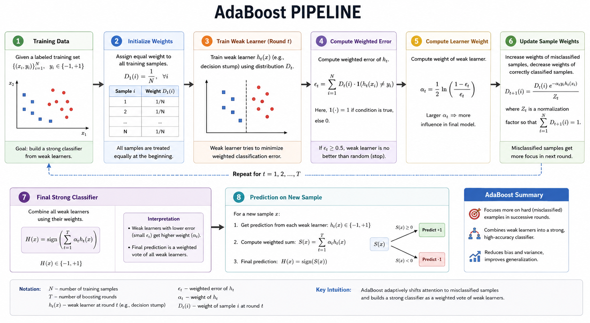
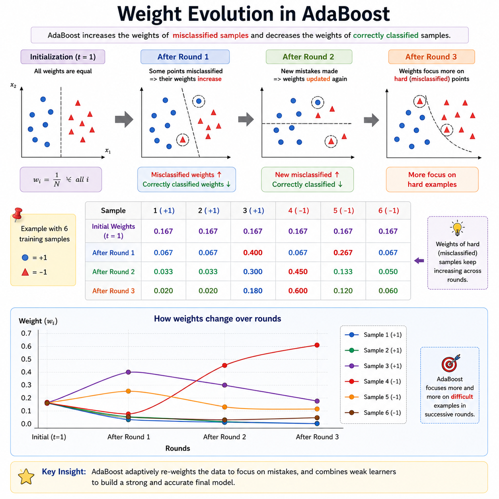
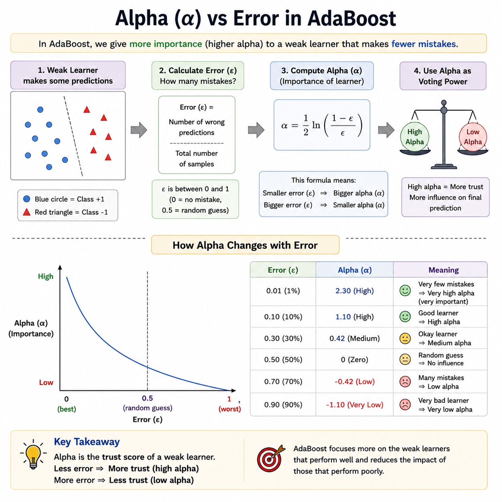

# AdaBoost

> **Turning weak learners into a strong ensemble — one mistake at a time.**

**What you will learn:** In this guide, you will understand how AdaBoost iteratively combines a sequence of simple models (called weak learners) into a single powerful classifier by making each new model focus harder on the examples previous ones got wrong. You will also learn when to apply AdaBoost in production settings, how to implement it from scratch vs. using Scikit-learn, and how to confidently answer interview questions on the topic.

---

## 1. What Is AdaBoost?

AdaBoost — short for **Adaptive Boosting** — is an ensemble learning algorithm introduced by Freund and Schapire in 1997. The core idea is elegantly simple: build a series of "weak" classifiers (models that are only slightly better than random guessing), and combine their outputs through a weighted vote to form a final prediction that is remarkably accurate. Unlike bagging (e.g., Random Forests), where models are trained independently in parallel, AdaBoost trains models **sequentially** — each one learning from the mistakes of the one before it.

Think of it like studying for an exam using a personalized flashcard deck. After each practice round, the flashcards you answered correctly become less likely to appear, and the ones you got wrong come up more frequently. Over many rounds, you end up reinforcing your weak spots. AdaBoost does exactly the same: it re-weights training examples so that misclassified samples receive higher importance in the next iteration, forcing each subsequent model to focus on the hard cases.

AdaBoost works best on **binary classification** tasks but can be extended to multi-class problems. Its base learner is typically a **decision stump** — a one-level decision tree with a single split. Despite using such simple base learners, AdaBoost frequently achieves state-of-the-art performance, and historically was one of the first algorithms to demonstrate that boosting truly works in practice.

---

## 2. Mathematical Formulation

### Final Strong Classifier

$$F(x) = \text{sign}\left(\sum_{t=1}^{T} \alpha_t \cdot h_t(x)\right)$$

| Symbol | Meaning |
|--------|---------|
| $F(x)$ | Final prediction for input $x$ (+1 or −1) |
| $T$ | Total number of boosting rounds (weak learners) |
| $\alpha_t$ | Weight (importance) assigned to the $t$-th weak learner |
| $h_t(x)$ | Prediction of the $t$-th weak learner on input $x$ |
| $\text{sign}(\cdot)$ | Maps positive values to +1, negative to −1 |

### Learner Weight

$$\alpha_t = \frac{1}{2} \ln\left(\frac{1 - \epsilon_t}{\epsilon_t}\right)$$

| Symbol | Meaning |
|--------|---------|
| $\alpha_t$ | Weight given to weak learner $t$ |
| $\epsilon_t$ | Weighted error rate of weak learner $t$ on training data |

**Significance:** When a weak learner has low error ($\epsilon_t \approx 0$), $\alpha_t$ is large — meaning it gets a loud vote in the final ensemble. When error approaches 0.5 (random guessing), $\alpha_t \approx 0$ — it's nearly silenced. This is how AdaBoost "trusts" good models and discounts poor ones.

### Sample Weight Update

$$w_i^{(t+1)} = w_i^{(t)} \cdot \exp\left(-\alpha_t \cdot y_i \cdot h_t(x_i)\right)$$

After normalization, correctly classified examples get lower weight and misclassified ones get higher weight, steering the next learner's attention.

---

## 3. How It Works — Step by Step



**Step 1: Initialize equal weights.**
Assign each of the $n$ training samples a weight of $\frac{1}{n}$. Every example starts with equal importance — nobody is considered "hard" yet.

*Analogy:* You hand out identical flashcards of all topics before your first study session.

**Step 2: Train a weak learner.**
Fit a simple model (e.g., a single-split decision tree) on the weighted training data. The model tries to minimize weighted classification error.

*Analogy:* You do a study session; some concepts you nail, others you miss.

**Step 3: Compute the learner's weighted error $\epsilon_t$.**
Sum the weights of all misclassified samples. If $\epsilon_t > 0.5$, flip the labels — the learner is worse than random!

**Step 4: Compute $\alpha_t$ — the learner's importance.**
Use the formula above. A near-perfect learner gets a large $\alpha_t$; a nearly-random one gets close to 0.

**Step 5: Update sample weights.**
Boost the weights of misclassified samples (they need more attention). Reduce the weights of correctly classified ones. Renormalize so all weights sum to 1.

*Analogy:* After the session, you pull the cards you missed to the front of the deck.

**Step 6: Repeat Steps 2–5 for $T$ rounds.**
Each new weak learner specializes in the "hard" examples the ensemble has been failing on.



**Step 7: Combine all learners into $F(x)$.**
Take the weighted majority vote — more competent learners get more say. The $\alpha_t$ curve below shows why this weighting is crucial.



---

## 4. Key Assumptions

| Assumption | Why It Matters | What Happens If Violated |
|------------|----------------|--------------------------|
| Weak learners perform better than random ($\epsilon_t < 0.5$) | The boosting bound only guarantees improvement if each learner beats chance | Training error may not decrease; the model can diverge |
| Labels are binary (+1 / −1) in the classic formulation | $\alpha_t$ formula and sign-function assume two-class output | Multi-class AdaBoost (SAMME) needed; original formulation breaks |
| Training data is clean and not heavily noisy | Noisy or mislabeled points get up-weighted aggressively and can dominate | Model overfits to outliers; accuracy on clean data drops sharply |
| Base learners are fast to train | AdaBoost runs $T$ sequential training rounds | Slow base learners make AdaBoost impractical for large $T$ |
| Feature space is informative | Weak learners need at least one good split | If no feature separates classes, all learners will be near-random |

---

## 5. When to Use / When Not to Use

| ✅ Use AdaBoost When | ❌ Avoid AdaBoost When |
|---------------------|----------------------|
| Dataset is clean and well-labeled | Data has significant noise or label errors |
| You need an interpretable ensemble of simple models | You need probability calibration (raw outputs are not probabilities) |
| Binary or small multi-class classification problems | Problem has many classes (Gradient Boosting scales better) |
| Feature dimensions are moderate | Very high-dimensional sparse data (SVMs or deep models may be better) |
| Baseline models (e.g., stumps) underfit | Real-time inference is critical (sequential nature adds latency) |
| You need a strong bias-variance trade-off | Training dataset is tiny (boosting needs enough examples to re-weight) |

---

## 6. Implementation Overview

| Aspect | From Scratch (NumPy) | Library (Scikit-learn) |
|--------|---------------------|----------------------|
| **Weight init** | Manually create array of $1/n$ | Handled internally |
| **Weak learner** | Fit `DecisionTreeClassifier(max_depth=1)` manually | `base_estimator` parameter |
| **Error calc** | Dot product of weights and misclassification mask | Automatic |
| **$\alpha_t$ calc** | Implement $\frac{1}{2}\ln(\frac{1-\epsilon}{\epsilon})$ directly | Automatic |
| **Weight update** | Apply exponential update + renormalize | Automatic |
| **Final prediction** | Weighted sign sum over all $h_t$ | `predict()` method |
| **Use case** | Learning internals, custom base learners | Production, benchmarking |

### Scikit-learn Quick Start

```python
from sklearn.ensemble import AdaBoostClassifier
from sklearn.tree import DecisionTreeClassifier
from sklearn.datasets import make_classification
from sklearn.model_selection import train_test_split
from sklearn.metrics import accuracy_score

# Generate a binary classification dataset
X, y = make_classification(n_samples=1000, n_features=10, random_state=42)
X_train, X_test, y_train, y_test = train_test_split(X, y, test_size=0.2, random_state=42)

# Build AdaBoost with decision stumps as base learners
model = AdaBoostClassifier(
    estimator=DecisionTreeClassifier(max_depth=1),  # Weak learner = stump
    n_estimators=100,       # Number of boosting rounds
    learning_rate=1.0,      # Shrinks each alpha_t contribution
    algorithm='SAMME',      # Use SAMME for multi-class or probability output
    random_state=42
)

# Train and evaluate
model.fit(X_train, y_train)
y_pred = model.predict(X_test)
print(f"Test Accuracy: {accuracy_score(y_test, y_pred):.4f}")
```

---

## 7. Top 5 Interview Questions

**Q1: How does AdaBoost differ from Bagging (e.g., Random Forest)?**
- Bagging: parallel, independent models; reduces variance
- Boosting: sequential, dependent models; reduces bias
- AdaBoost reweights samples; Bagging resamples with replacement
- AdaBoost is more sensitive to noise; Bagging is more robust

**Q2: Can AdaBoost overfit? Under what conditions?**
- Theoretically resistant to overfitting as $T$ grows (on clean data)
- In practice: overfits when noisy/mislabeled data is present (outliers get up-weighted)
- Solution: early stopping, noise-robust boosting variants (e.g., RobustBoost)

**Q3: What is the role of $\alpha_t$? What happens when $\epsilon_t = 0.5$?**
- $\alpha_t$ controls how loudly each learner votes in the final ensemble
- $\epsilon_t = 0.5$ → $\alpha_t = 0$ → learner contributes nothing (random guessing)
- If $\epsilon_t > 0.5$, the sign of $\alpha_t$ flips — learner's predictions are inverted

**Q4: Why use decision stumps as the base learner?**
- Fast to train; very low variance (high bias)
- Boosting corrects the bias; stumps keep complexity controlled
- Strong theoretical guarantees with stumps; deep trees can overfit

**Q5: How does the `learning_rate` hyperparameter affect AdaBoost?**
- Scales $\alpha_t$ contribution by a shrinkage factor $\nu \in (0, 1]$
- Lower rate → more conservative updates → needs higher $T$
- Trade-off: lower learning rate + more rounds = better generalization, slower training

---

## 8. Quick Reference Table

| Item | Detail |
|------|--------|
| **Algorithm Type** | Boosting (Sequential Ensemble) |
| **Learning Type** | Supervised — Classification (extendable to regression) |
| **Strengths** | Simple to implement, interpretable, low hyperparameter burden, strong theory |
| **Weaknesses** | Sensitive to noise/outliers, sequential (not parallelizable), binary by default |
| **Time Complexity** | $O(T \cdot n \cdot d)$ — $T$ rounds, $n$ samples, $d$ features |
| **Space Complexity** | $O(T \cdot \text{model size})$ — stores all $T$ weak learners |
| **Key Hyperparameters** | `n_estimators` ($T$), `learning_rate` ($\nu$), `base_estimator` (depth) |
| **Evaluation Metrics** | Accuracy, ROC-AUC, F1-Score, Precision-Recall |

---

## 9. References & Further Reading

| Resource | Link |
|----------|------|
| 📄 **Original Paper** | Freund & Schapire (1997) — *A Decision-Theoretic Generalization of On-Line Learning* — [Read](https://www.sciencedirect.com/science/article/pii/S002200009791504X) |
| 📘 **Best Tutorial** | Towards Data Science — [AdaBoost, Clearly Explained](https://towardsdatascience.com/boosting-algorithm-adaboost-b6737a9ee60c) |
| 📓 **Kaggle Notebook** | [AdaBoost Step-by-Step on Titanic](https://www.kaggle.com/code/prashant111/adaboost-classifier-tutorial) |
| 📚 **Official Docs** | Scikit-learn — [AdaBoostClassifier](https://scikit-learn.org/stable/modules/generated/sklearn.ensemble.AdaBoostClassifier.html) |
| 🎥 **Additional Learning** | StatQuest with Josh Starmer — [AdaBoost on YouTube](https://www.youtube.com/watch?v=LsK-xG1cLYA) |
