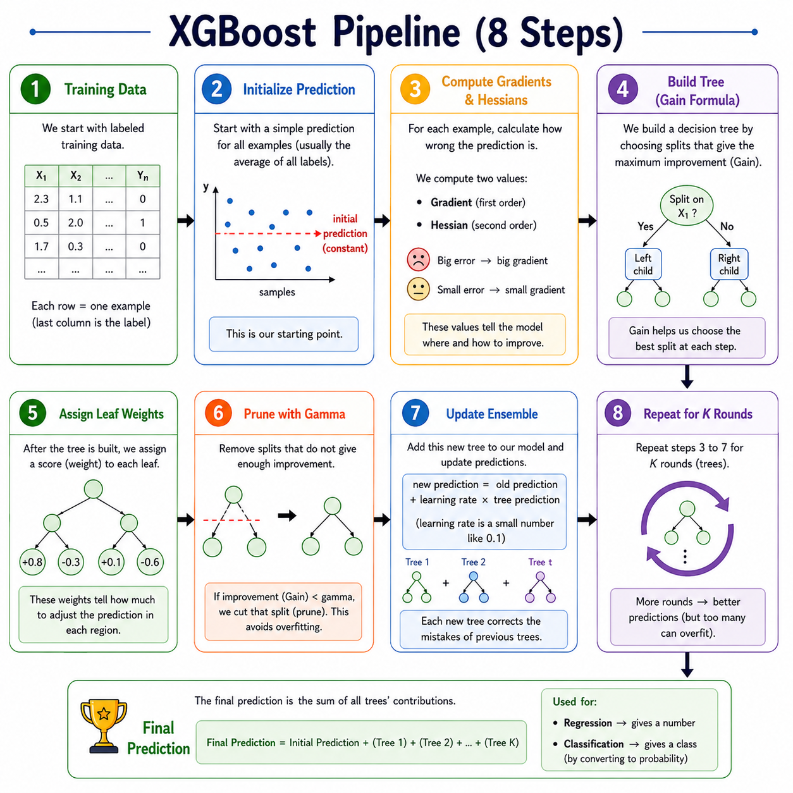
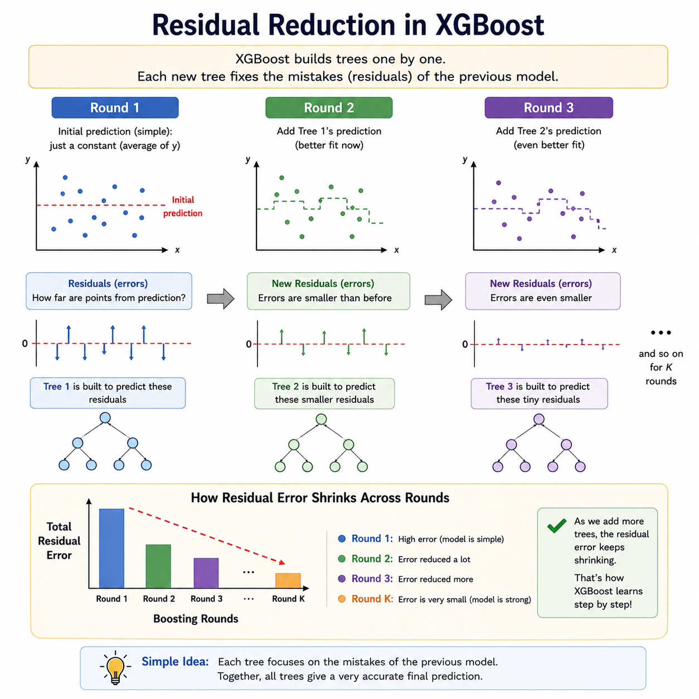
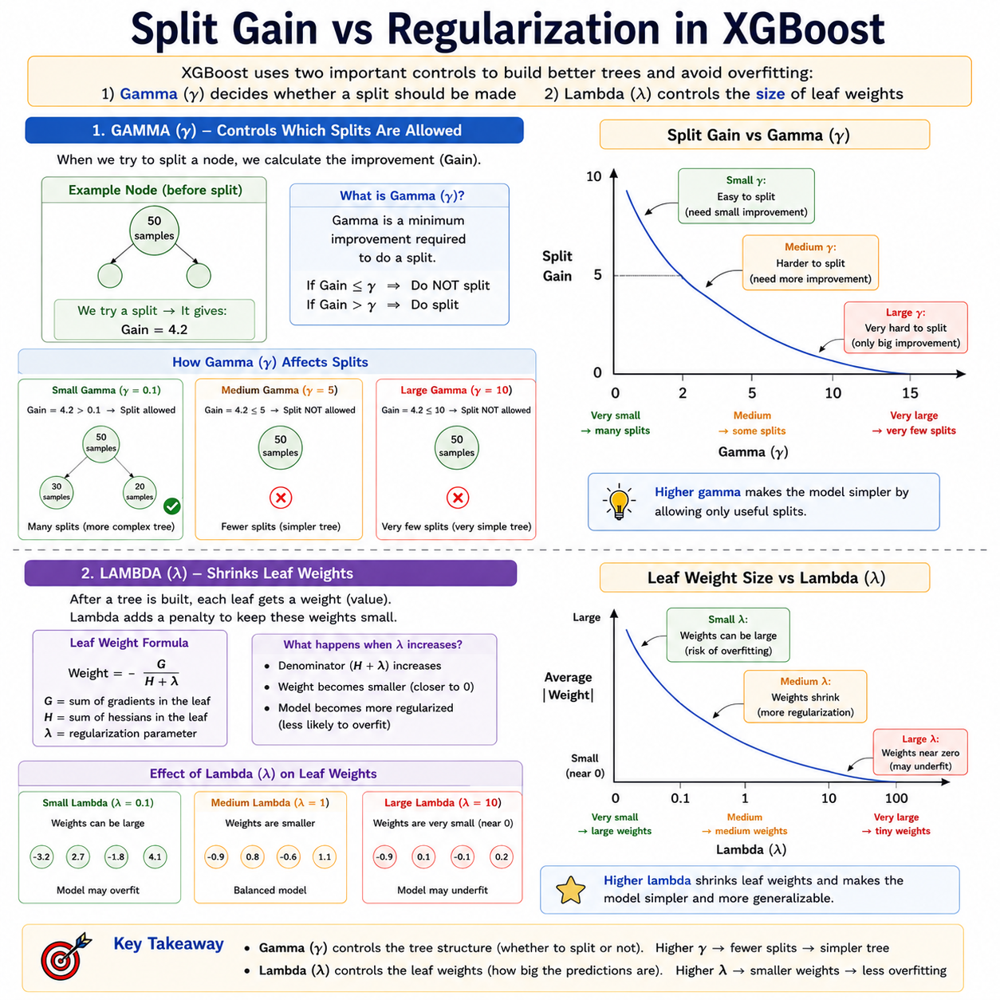

# XGBoost

> **Gradient boosting, supercharged — the algorithm that dominates Kaggle and production alike.**

**What you will learn:** In this guide, you will understand how XGBoost builds decision trees sequentially, where each new tree corrects the residual errors of all previous trees using a mathematically rigorous second-order gradient descent in function space. You will also learn its regularized objective, when to deploy it in production, how it compares to other boosting methods, and how to answer XGBoost interview questions with precision.

---

## 1. What Is XGBoost?

XGBoost — short for **eXtreme Gradient Boosting** — is an optimized, scalable implementation of the gradient boosting framework, introduced by Tianqi Chen in 2016. While AdaBoost re-weights training samples to focus on mistakes, XGBoost takes a fundamentally different approach: it fits each new tree directly to the **residual errors** (gradients) left behind by the current ensemble, and does so using a clever second-order mathematical approximation to find splits faster and more accurately.

Think of it like a team of editors improving a manuscript. The first editor writes a rough draft. The second editor reads only the mistakes and writes a correction memo. The third editor corrects what the second missed. The final manuscript is the sum of the original draft plus all correction memos — each editor focused only on what was still wrong. XGBoost works identically: each new tree is a "correction tree" for the errors the ensemble has accumulated so far.

What truly separates XGBoost from vanilla Gradient Boosting is a combination of engineering and mathematics: built-in **L1 and L2 regularization** to prevent overfitting, native handling of **missing values**, **column subsampling** for variance reduction, a **second-order Taylor expansion** of the loss for smarter splits, and a cache-aware block data structure that enables parallel computation. These design choices make XGBoost one of the most reliable algorithms for structured and tabular data across both research and industry.

---

## 2. Mathematical Formulation

### Objective Function

$$\mathcal{L} = \sum_{i=1}^{n} l\bigl(y_i,\ \hat{y}_i\bigr) + \sum_{k=1}^{K} \Omega(f_k)$$

| Symbol | Meaning |
|--------|---------|
| $\mathcal{L}$ | Total objective to minimize during training |
| $l(y_i, \hat{y}_i)$ | Differentiable loss function (e.g., MSE for regression, log-loss for classification) |
| $y_i$ | True label for sample $i$ |
| $\hat{y}_i$ | Current ensemble prediction for sample $i$ |
| $K$ | Total number of trees built so far |
| $\Omega(f_k)$ | Regularization term penalizing the complexity of tree $k$ |

### Regularization Term

$$\Omega(f) = \gamma T + \frac{1}{2}\lambda \sum_{j=1}^{T} w_j^2$$

| Symbol | Meaning |
|--------|---------|
| $T$ | Number of leaves in the tree — penalizes overly bushy trees |
| $w_j$ | Output score (weight) at leaf $j$ |
| $\gamma$ | Minimum loss reduction required to allow a split (structural penalty) |
| $\lambda$ | L2 regularization coefficient on leaf weights (shrinks leaf values) |

### Second-Order Taylor Approximation (for each new tree $t$)

$$\mathcal{L}^{(t)} \approx \sum_{i=1}^{n} \Bigl[ g_i f_t(x_i) + \tfrac{1}{2}\, h_i f_t^2(x_i) \Bigr] + \Omega(f_t)$$

| Symbol | Meaning |
|--------|---------|
| $g_i = \partial_{\hat{y}}\, l(y_i, \hat{y}_i)$ | First derivative (gradient) — direction and magnitude of error |
| $h_i = \partial^2_{\hat{y}}\, l(y_i, \hat{y}_i)$ | Second derivative (hessian) — curvature of the loss surface |
| $f_t(x_i)$ | Output of the new tree being added at round $t$ |

**Significance:** Using both $g_i$ (gradient) and $h_i$ (hessian) gives XGBoost a more accurate local model of the loss landscape than first-order methods. This means it finds better split points in fewer rounds. For MSE loss, $h_i = 1$ (flat); for log-loss, $h_i = \hat{p}(1-\hat{p})$ (varies per sample), making the curvature sample-specific and the splits smarter.

### Optimal Leaf Weight

$$w_j^* = -\frac{\sum_{i \in \text{leaf}_j} g_i}{\sum_{i \in \text{leaf}_j} h_i + \lambda}$$

This closed-form formula gives the best output score for each leaf — no search needed once the tree structure is fixed.

---

## 3. How It Works — Step by Step



**Step 1: Initialize with a base prediction.**
Start all predictions with a constant — the mean of the target for regression, or log-odds for classification. This is the "rough first draft" before any tree is built.

*Analogy:* The first editor writes the manuscript knowing only the average quality level expected.

**Step 2: Compute gradients $g_i$ and hessians $h_i$ for every sample.**
These two numbers describe how wrong the current prediction is and how sharply wrong it is — giving a rich, local picture of each sample's error.

*Analogy:* $g_i$ tells you "Chapter 3 is too long by 200 words." $h_i$ tells you "and that problem gets exponentially worse near the deadline — fix it urgently."

**Step 3: Build a new decision tree using the gain formula.**
For each candidate split, XGBoost computes a **gain score**:

$$\text{Gain} = \frac{1}{2}\left[\frac{G_L^2}{H_L+\lambda} + \frac{G_R^2}{H_R+\lambda} - \frac{(G_L+G_R)^2}{H_L+H_R+\lambda}\right] - \gamma$$

The split with the highest positive gain is chosen. If no split achieves gain $> 0$, the node becomes a leaf.

**Step 4: Assign optimal leaf weights $w_j^*$.**
Use the closed-form formula above to compute the best output for each leaf — analytically exact, no gradient descent needed at this step.



**Step 5: Prune the tree with $\gamma$.**
Any branch whose gain falls below $\gamma$ is removed after the tree is built. This post-pruning strategy prevents splits that technically improve the training set but add complexity without meaningful gain.

**Step 6: Add the tree to the ensemble with learning rate $\eta$.**
Update: $\hat{y}_i \leftarrow \hat{y}_i + \eta \cdot f_t(x_i)$. The learning rate $\eta$ shrinks each tree's contribution, making the ensemble more robust by preventing any single tree from dominating.

**Step 7: Repeat Steps 2–6 for $K$ rounds.**
Each round targets the residuals of the current ensemble. Over rounds, errors shrink, and the predictions converge.



**Step 8: Final prediction.**
Sum all tree outputs scaled by $\eta$, then apply the output transform (e.g., sigmoid for binary classification).

---

## 4. Key Assumptions

| Assumption | Why It Matters | What Happens If Violated |
|------------|----------------|--------------------------|
| Loss function is twice-differentiable | XGBoost requires $g_i$ and $h_i$ at every round | Custom non-smooth losses break the optimizer; use approximations or surrogate losses |
| Features carry predictive signal | Trees need at least one informative split per round | Irrelevant features add noise; use feature importance scores to prune inputs |
| Training dataset is large enough per leaf | `min_child_weight` enforces minimum hessian sum per leaf | Too-small leaves overfit; increase `min_child_weight` on small datasets |
| Data is tabular / structured | XGBoost excels on numerical/categorical structured input | Raw images or text without feature engineering underperform vs. deep learning |
| Feature distributions are reasonably stable | Train/test distribution shift misleads the gradient signal | Causes generalization failure; monitor feature drift in production |

---

## 5. When to Use / When Not to Use

| ✅ Use XGBoost When | ❌ Avoid XGBoost When |
|--------------------|----------------------|
| Tabular data with mixed numerical and categorical features | Raw images, audio, or text without heavy feature engineering |
| Medium-to-large datasets (5K to 10M rows) | Dataset is very small (< 500 rows) — high overfitting risk |
| Missing values are present in the dataset | Sub-millisecond real-time inference is required |
| Non-linear feature interactions need to be captured | Full model interpretability is the primary requirement |
| Kaggle competitions or ML benchmarks on structured data | Streaming or online learning is needed (XGBoost is batch-only) |
| You want regularization without manual feature engineering | Very high-dimensional sparse data (LightGBM or linear models may be faster) |

---

## 6. Implementation Overview

| Aspect | From Scratch (NumPy) | Library (XGBoost / Scikit-learn API) |
|--------|---------------------|--------------------------------------|
| **Base prediction** | Compute mean or log-odds manually | Handled internally by objective |
| **Gradient & hessian** | Derive and compute $g_i$, $h_i$ for your loss | Automatic for all built-in objectives |
| **Tree construction** | Implement gain formula with exhaustive split search | `max_depth`, `n_estimators` control it |
| **Leaf weight** | Compute $w_j^* = -\frac{\sum g_i}{\sum h_i + \lambda}$ analytically | Computed automatically per leaf |
| **Regularization** | Apply $\gamma$ pruning and $\lambda$ weight penalty manually | `gamma`, `reg_lambda`, `reg_alpha` params |
| **Learning rate** | Multiply each tree output by $\eta$ before adding | `learning_rate` parameter |
| **Missing values** | Implement default direction logic per split | Native — no imputation needed |
| **Use case** | Deep understanding, custom losses, research | All production, benchmarking, competitions |

### XGBoost Scikit-learn API Quick Start

```python
from xgboost import XGBClassifier
from sklearn.datasets import make_classification
from sklearn.model_selection import train_test_split
from sklearn.metrics import accuracy_score, roc_auc_score

# Generate a binary classification dataset
X, y = make_classification(n_samples=5000, n_features=20, random_state=42)
X_train, X_test, y_train, y_test = train_test_split(
    X, y, test_size=0.2, random_state=42
)

# Build XGBoost classifier
model = XGBClassifier(
    n_estimators=300,        # Number of boosting rounds (trees)
    learning_rate=0.05,      # Shrinkage factor eta — smaller = more robust
    max_depth=6,             # Maximum depth of each tree
    subsample=0.8,           # Row subsampling per tree (reduces overfitting)
    colsample_bytree=0.8,    # Feature subsampling per tree
    gamma=1.0,               # Minimum gain required to make a split
    reg_lambda=1.0,          # L2 regularization on leaf weights
    reg_alpha=0.1,           # L1 regularization on leaf weights
    eval_metric='logloss',
    random_state=42
)

# Train with early stopping to prevent overfitting
model.fit(
    X_train, y_train,
    eval_set=[(X_test, y_test)],
    verbose=50
)

# Evaluate
y_pred  = model.predict(X_test)
y_proba = model.predict_proba(X_test)[:, 1]
print(f"Accuracy : {accuracy_score(y_test, y_pred):.4f}")
print(f"ROC-AUC  : {roc_auc_score(y_test, y_proba):.4f}")
```

---

## 7. Top 5 Interview Questions

**Q1: How is XGBoost different from AdaBoost and vanilla Gradient Boosting?**
- AdaBoost: re-weights samples, exponential loss, no regularization, uses learner vote weights $\alpha_t$
- Vanilla GBM: fits trees to pseudo-residuals using first-order gradients only
- XGBoost: second-order Taylor expansion (uses $g_i$ + $h_i$), built-in L1/L2 regularization, column subsampling, cache-aware parallel split-finding, native missing value handling
- Engineering edge: block-compressed column data structures allow near-parallel tree construction

**Q2: What is the role of the hessian $h_i$? Why is it important?**
- Captures the curvature of the loss — how "confident" the gradient signal is for each sample
- Appears in optimal leaf weight: $w_j^* = -\frac{\sum g_i}{\sum h_i + \lambda}$ — high $h_i$ = more certainty = less shrinkage
- Also in gain formula — prevents overly aggressive splits on uncertain regions
- For MSE: $h_i = 1$ (uniform); for log-loss: $h_i = \hat{p}(1-\hat{p})$ (sample-specific confidence)

**Q3: What does `gamma` do, and how is it different from `reg_lambda`?**
- `gamma` ($\gamma$): minimum loss reduction to allow a split — prunes the tree **structure** (number of nodes)
- `reg_lambda` ($\lambda$): L2 penalty on leaf **values** — shrinks the magnitude of leaf scores
- `gamma` decides whether to split at all; `reg_lambda` decides how large each leaf value can be
- Together: `gamma` controls structural complexity, `reg_lambda` controls value complexity

**Q4: How does XGBoost handle missing values natively?**
- During training, for each split, XGBoost tries routing missing values both left and right
- It picks the direction that gives better gain — this "default direction" is learned per split
- At inference, missing values are automatically routed to the learned default branch
- No imputation pipeline needed — this is a first-class feature, not a workaround

**Q5: When would you choose LightGBM over XGBoost?**
- LightGBM uses leaf-wise (best-first) growth; XGBoost uses level-wise (breadth-first) growth
- LightGBM is faster on very large datasets (millions of rows) and high-cardinality features
- XGBoost is preferred when fine-grained regularization control is needed or dataset is moderate-sized
- LightGBM has better support for categorical features natively; XGBoost requires encoding
- In practice: benchmark both — accuracy difference is often small; speed/memory difference can be large

---

## 8. Quick Reference Table

| Item | Detail |
|------|--------|
| **Algorithm Type** | Gradient Boosting (Sequential Ensemble of Decision Trees) |
| **Learning Type** | Supervised — Classification, Regression, Ranking, Survival |
| **Strengths** | Regularization built-in, handles missing values natively, fast, state-of-the-art on tabular data |
| **Weaknesses** | Many hyperparameters to tune, slower than LightGBM on very large data, not for unstructured data |
| **Time Complexity** | $O(K \cdot d \cdot n \log n)$ — $K$ trees, $d$ features, $n$ samples (approximate split finding) |
| **Space Complexity** | $O(K \cdot 2^D + n \cdot d)$ — trees + data block storage |
| **Key Hyperparameters** | `n_estimators`, `learning_rate`, `max_depth`, `subsample`, `colsample_bytree`, `gamma`, `reg_lambda`, `reg_alpha` |
| **Evaluation Metrics** | RMSE / MAE (regression), AUC-ROC / Log-loss / F1-Score (classification) |

---

## 9. References & Further Reading

| Resource | Link |
|----------|------|
| 📄 **Original Paper** | Chen & Guestrin (2016) — *XGBoost: A Scalable Tree Boosting System* — [Read on arXiv](https://arxiv.org/abs/1603.02754) |
| 📘 **Best Tutorial** | Towards Data Science — [XGBoost Algorithm: Long May She Reign](https://towardsdatascience.com/https-medium-com-vishalmorde-xgboost-algorithm-long-she-may-rein-edd9f99be63d) |
| 📓 **Kaggle Notebook** | [A Complete Guide to XGBoost](https://www.kaggle.com/code/dansbecker/xgboost) |
| 📚 **Official Docs** | XGBoost Documentation — [xgboost.readthedocs.io](https://xgboost.readthedocs.io/en/stable/) |
| 🎥 **Additional Learning** | StatQuest with Josh Starmer — [XGBoost on YouTube](https://www.youtube.com/watch?v=OtD8wVaFm6E) |
