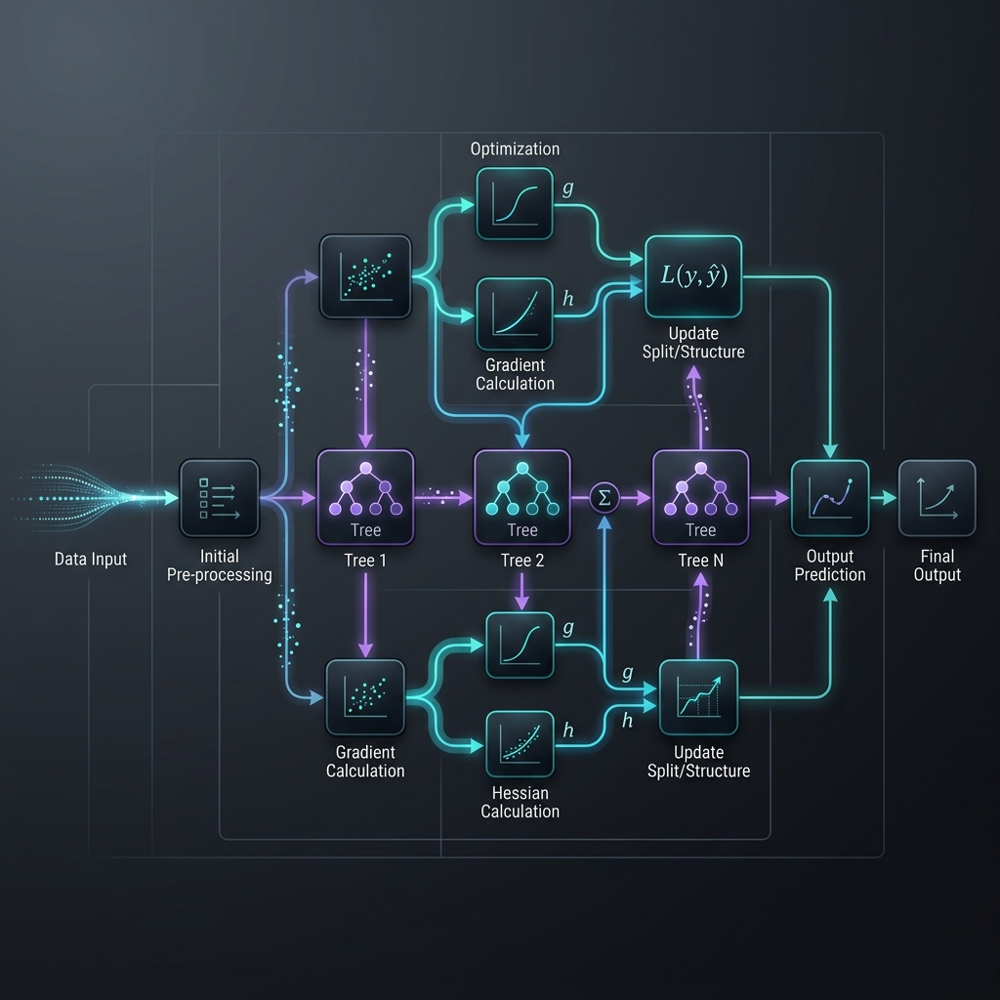

# XGBoost

> **Extreme Gradient Boosting — where performance meets scalability.**

**What you will learn:** In this guide, you will understand the core concepts of XGBoost, how to implement it from scratch vs. using Scikit-learn, and how to answer technical interview questions.

---

## 1. What Is XGBoost?

XGBoost is an optimized distributed gradient boosting library designed to be highly efficient, flexible, and portable. It implements machine learning algorithms under the Gradient Boosting framework with an explicit focus on model performance and execution speed. It uses a more regularized model formalization to control over-fitting, which gives it better performance.

### Real-World Analogy
*Analogy:* You have a team of highly trained specialists. Each specialist reviews the errors of the team, calculates exactly how much to adjust to fix the error (using 2nd order derivatives), but they are strictly penalized if they try to memorize the answers (regularization).

---

## 2. Mathematical Formulation

### Objective Function:

$$ \text{Obj} = \sum_{i=1}^n L(y_i, \hat{y}_i) + \sum_{k=1}^K \Omega(f_k) $$

| Symbol | Meaning |
|---|---|
| $L$ | Differentiable convex loss function |
| $\hat{y}_i$ | Prediction for $i$-th instance |
| $\Omega(f_k)$ | Regularization term (complexity of tree $k$) |
| $\gamma, \lambda$ | Penalties for leaves and L2 regularization |

### Optimal Leaf Weight:

$$ w_j^* = -\frac{\sum_{i \in I_j} g_i}{\sum_{i \in I_j} h_i + \lambda} $$

| Symbol | Meaning |
|---|---|
| $w_j^*$ | Optimal weight for leaf $j$ |
| $g_i, h_i$ | First and second order gradients |
| $\lambda$ | L2 regularization |

---

## 3. How It Works — Step by Step



**Step 1:** Initialize the model.
**Step 2:** Iteratively fit to the target (residuals or gradient).
**Step 3:** Optimize the specific loss function using defined parameters.
**Step 4:** Combine outputs into final robust predictions.

---

## 4. Key Assumptions

| Assumption | Why It Matters | What Happens If Violated |
|---|---|---|
| Enough RAM | XGBoost loads data into memory | Out of Memory errors |
| Hyperparameters tuned | Highly sensitive to tuning | Can easily overfit |

---

## 5. When to Use / When Not to Use

| ✅ Use When | ❌ Avoid When |
|---|---|
| Tabular data | Unstructured data (images/text) |
| Kaggle competitions | Need extreme interpretability |
| Speed is critical | Very tiny datasets |

---

## 6. Implementation Overview

| Aspect | From Scratch (NumPy) | Library (XGBoost) |
|---|---|---|
| Trees | Custom DecisionTree with Gain | `XGBClassifier` |
| Splits | Exact Greedy Algorithm | Histogram/Exact |

### Scikit-learn / Native Library Quick Start

```python
from xgboost import XGBClassifier
model = XGBClassifier(n_estimators=100, learning_rate=0.1, max_depth=3)
model.fit(X_train, y_train)
```

---

## 7. Top 5 Interview Questions

**Q1: How does XGBoost differ from GBM?**
- XGBoost includes explicit L1/L2 regularization, uses 2nd-order approximation (Hessian), and supports parallel split finding.

**Q2: What is the role of lambda and alpha?**
- Lambda acts as L2 regularization on leaf weights, alpha as L1 regularization. They prevent overfitting.

**Q3: How does XGBoost handle missing values?**
- It learns a default direction for missing values during training based on training loss.

**Q4: What is exact greedy vs approximate split finding?**
- Exact evaluates all possible splits; approximate uses histograms/quantiles for faster processing.

**Q5: Why use the Hessian?**
- It provides curvature information, allowing for larger, more accurate steps toward the minimum of the loss.

---

## 8. Quick Reference Table

| Item | Detail |
|------|--------|
| **Algorithm Type** | Ensemble Learning |
| **Strengths** | Extremely high accuracy |
| **Weaknesses** | Can be complex to tune |

---

## 9. References & Further Reading

| Resource | Link |
|---|---|
| Paper | [XGBoost: A Scalable Tree Boosting System](https://arxiv.org/abs/1603.02754) |

---

## 10. Environment & Setup

To run the accompanying Jupyter Notebook, ensure you have the following installed:
```bash
pip install numpy pandas scikit-learn matplotlib seaborn
```
For specific libraries, see the top cell of the Jupyter Notebook.
