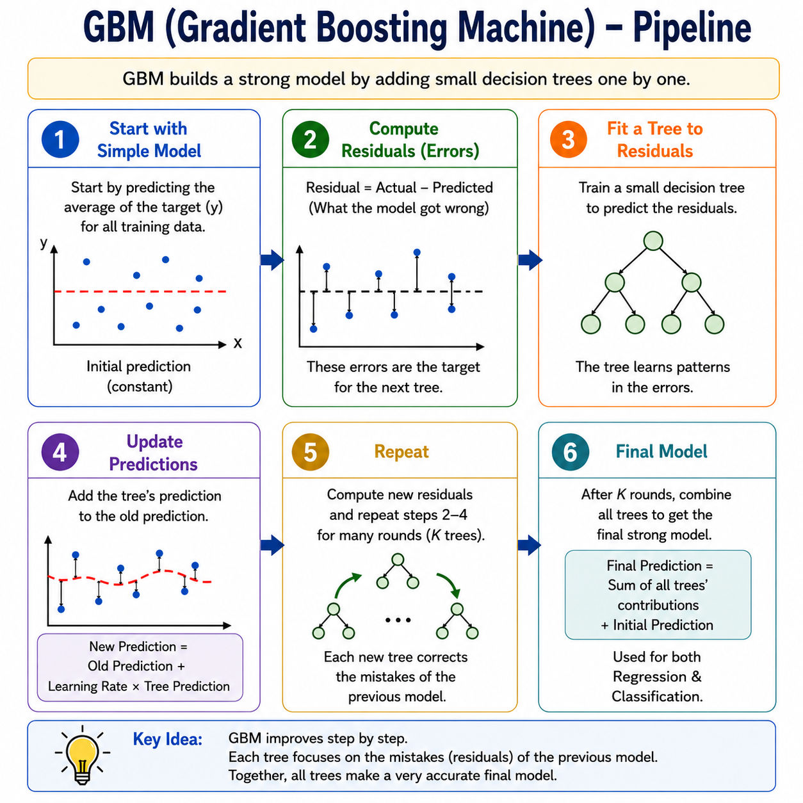
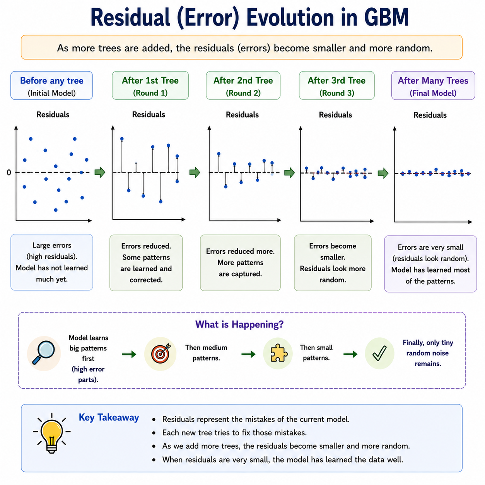
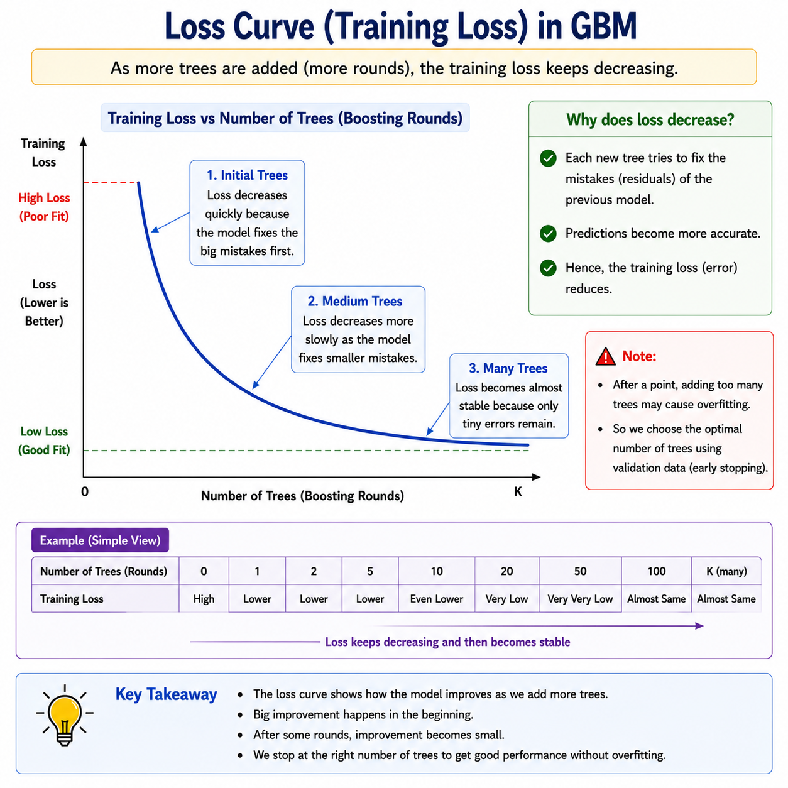

# Gradient Boosting Machine (GBM)

> **Building a strong predictor one correction at a time — the foundation of modern boosting.**

**What you will learn:** In this guide, you will understand how Gradient Boosting Machines sequentially build an ensemble of decision trees where each new tree fits the residual errors (gradients) of the current ensemble using gradient descent in function space. You will also learn its core mathematical framework, when to deploy it in production versus alternatives like XGBoost or LightGBM, and how to answer GBM interview questions with depth and confidence.

---

## 1. What Is GBM?

Gradient Boosting Machine (GBM) is a supervised ensemble learning algorithm introduced by Jerome Friedman in 1999–2001. The central idea is to build a strong predictive model by combining many weak learners — typically shallow decision trees — in a sequential, additive manner. Unlike bagging methods (e.g., Random Forests) that build trees in parallel and average their outputs, GBM builds each tree to specifically correct the mistakes of everything that came before it.

Think of it like a student preparing for competitive exams using a personal tutor. After the first mock test, the tutor identifies every wrong answer and creates a targeted study plan focused only on those topics. After the second mock test, the tutor again focuses only on the remaining gaps. Over many sessions, the student's performance improves by progressively filling in weaknesses — not by repeating everything from scratch. GBM works the same way: each new tree is a "gap-filling plan" that addresses what the current ensemble still gets wrong.

The word "gradient" is the key. Instead of literally re-weighting samples (like AdaBoost) or re-computing residuals naively, GBM frames the problem as **gradient descent in the space of functions**. The negative gradient of the loss function at each step tells the next tree exactly in which direction predictions need to move to reduce error. This elegant mathematical framing allows GBM to work with virtually any differentiable loss function — making it applicable to regression, classification, ranking, and beyond.

---

## 2. Mathematical Formulation

### Additive Model

$$F_M(x) = F_0(x) + \sum_{m=1}^{M} \eta \cdot h_m(x)$$

| Symbol | Meaning |
|--------|---------|
| $F_M(x)$ | Final ensemble prediction after $M$ trees |
| $F_0(x)$ | Initial base prediction (e.g., mean of target for regression) |
| $M$ | Total number of boosting rounds (trees) |
| $\eta$ | Learning rate — shrinks each tree's contribution to prevent overfitting |
| $h_m(x)$ | The $m$-th weak learner (decision tree) fitted at round $m$ |

### Pseudo-Residuals (Negative Gradient)

$$r_{im} = -\left[\frac{\partial\, l(y_i,\ F(x_i))}{\partial\, F(x_i)}\right]_{F=F_{m-1}}$$

| Symbol | Meaning |
|--------|---------|
| $r_{im}$ | Pseudo-residual for sample $i$ at round $m$ — the training target for tree $m$ |
| $l(y_i, F(x_i))$ | Loss function measuring prediction error for sample $i$ |
| $y_i$ | True label for sample $i$ |
| $F(x_i)$ | Current ensemble prediction before adding tree $m$ |
| $\partial / \partial F(x_i)$ | Partial derivative with respect to the prediction — the gradient direction |

**Significance:** The pseudo-residuals $r_{im}$ tell each new tree exactly "how much and in which direction" to push the prediction for every sample. For MSE loss, $r_{im} = y_i - F_{m-1}(x_i)$ — the literal residual. For other losses like log-loss, the pseudo-residual is a transformed version of the error, making GBM applicable far beyond simple regression.

### Optimal Step Size (Line Search)

$$\rho_m = \arg\min_{\rho} \sum_{i=1}^{n} l\!\left(y_i,\ F_{m-1}(x_i) + \rho \cdot h_m(x_i)\right)$$

This finds the best scaling factor $\rho_m$ for each tree $h_m$ before adding it to the ensemble, ensuring each step moves in the right direction by just the right amount.

---

## 3. How It Works — Step by Step



**Step 1: Initialize with a constant base prediction $F_0(x)$.**
For regression, this is simply the mean of the target variable. For classification, it is the log-odds of the positive class. Every sample starts with this same prediction.

*Analogy:* The tutor's starting assumption is that every student is at the class average.

**Step 2: Compute pseudo-residuals $r_{im}$ for every training sample.**
Take the negative gradient of the loss with respect to the current predictions. These residuals are the "error signal" — they encode both direction and magnitude of correction needed.

*Analogy:* The tutor scores the mock test and notes exactly how far off each answer was and in which direction.

**Step 3: Fit a decision tree $h_m(x)$ to the pseudo-residuals.**
The tree learns to predict the residuals — not the original target. This tree's job is purely to capture the remaining patterns in the current errors.

*Analogy:* The tutor creates a lesson plan targeting only the gap topics, not the full syllabus.



**Step 4: Find the optimal step size $\rho_m$ via line search.**
Scale the tree's predictions by the best factor $\rho_m$ that minimizes the loss. This prevents overshooting in any one direction.

**Step 5: Update the ensemble.**
$$F_m(x) = F_{m-1}(x) + \eta \cdot \rho_m \cdot h_m(x)$$
The learning rate $\eta$ further shrinks the contribution, acting as a safety net against overfitting.

*Analogy:* The tutor doesn't overload the student with 100% of new material at once — they introduce it gradually.

**Step 6: Repeat Steps 2–5 for $M$ rounds.**
Each iteration targets the residuals of the updated ensemble. Errors shrink progressively across rounds.

**Step 7: Final prediction.**
Sum all tree contributions. For classification, apply the sigmoid or softmax transform to the final score.



---

## 4. Key Assumptions

| Assumption | Why It Matters | What Happens If Violated |
|------------|----------------|--------------------------|
| Loss function is differentiable | GBM requires a gradient at every step | Non-differentiable losses break the gradient computation; use surrogate losses |
| Weak learners are better than random | Each tree must capture some signal in the residuals | If trees fit pure noise, boosting amplifies noise and overfits badly |
| Training data is representative | Gradients are computed on training data — distribution shift misleads them | Model generalizes poorly; use cross-validation and monitor train/val gap |
| Features carry predictive information | Trees need at least one informative split per round | Irrelevant features slow convergence; prune with feature importance |
| Sufficient data per leaf | Each leaf needs enough samples to estimate a reliable output value | Overfitting on small leaves; use `min_samples_leaf` to enforce minimum |

---

## 5. When to Use / When Not to Use

| ✅ Use GBM When | ❌ Avoid GBM When |
|----------------|------------------|
| Tabular data with complex non-linear relationships | Raw images, audio, or unstructured text |
| You need a well-understood, theory-grounded boosting baseline | You need a very fast training loop — use XGBoost or LightGBM instead |
| Custom or non-standard loss functions are required | Dataset is tiny (< 500 samples) — high overfitting risk |
| Both regression and classification tasks on structured data | Real-time inference with strict latency constraints |
| Interpretability via feature importances is needed | Missing values are prevalent — XGBoost handles them natively, GBM does not |
| You want fine control over the boosting process | You need GPU acceleration — sklearn GBM is CPU-only |

---

## 6. Implementation Overview

| Aspect | From Scratch (NumPy) | Library (Scikit-learn) |
|--------|---------------------|------------------------|
| **Base prediction** | Compute mean or log-odds manually | Set via `init` parameter |
| **Pseudo-residuals** | Compute $-\partial l / \partial F$ analytically for your loss | Automatic for all built-in losses |
| **Tree fitting** | Fit `DecisionTreeRegressor` to residuals each round | `max_depth`, `n_estimators` control this |
| **Line search** | Minimize loss over $\rho$ per leaf or globally | Computed internally per leaf |
| **Ensemble update** | $F_m = F_{m-1} + \eta \cdot \rho_m \cdot h_m$ manually | `learning_rate` parameter |
| **Stopping criterion** | Track validation loss manually, stop when it rises | `n_iter_no_change`, `validation_fraction` |
| **Use case** | Research, custom losses, learning the internals | All production and benchmarking use |

### Scikit-learn Quick Start

```python
from sklearn.ensemble import GradientBoostingClassifier
from sklearn.datasets import make_classification
from sklearn.model_selection import train_test_split
from sklearn.metrics import accuracy_score, roc_auc_score

# Generate a binary classification dataset
X, y = make_classification(n_samples=5000, n_features=20, random_state=42)
X_train, X_test, y_train, y_test = train_test_split(
    X, y, test_size=0.2, random_state=42
)

# Build Gradient Boosting Classifier
model = GradientBoostingClassifier(
    n_estimators=200,          # Number of boosting rounds (trees)
    learning_rate=0.05,        # Shrinkage factor eta
    max_depth=4,               # Depth of each individual tree
    subsample=0.8,             # Stochastic GBM: fraction of samples per tree
    min_samples_leaf=20,       # Minimum samples per leaf (regularization)
    max_features='sqrt',       # Feature subsampling per split
    validation_fraction=0.1,   # Fraction of training data for early stopping
    n_iter_no_change=15,       # Stop if no improvement for 15 rounds
    random_state=42
)

# Train the model
model.fit(X_train, y_train)

# Evaluate
y_pred  = model.predict(X_test)
y_proba = model.predict_proba(X_test)[:, 1]
print(f"Accuracy : {accuracy_score(y_test, y_pred):.4f}")
print(f"ROC-AUC  : {roc_auc_score(y_test, y_proba):.4f}")
print(f"Rounds used: {model.n_estimators_}")
```

---

## 7. Top 5 Interview Questions

**Q1: What is the difference between GBM, AdaBoost, and XGBoost?**
- AdaBoost: re-weights samples using exponential loss; learner importance via $\alpha_t$; no regularization
- GBM: fits trees to negative gradients of any differentiable loss; learning rate shrinkage; subsample option
- XGBoost: GBM with second-order Taylor expansion (hessian), built-in L1/L2 regularization, native missing value handling, parallel column-block split finding
- GBM is the conceptual foundation; XGBoost is the engineered, production-grade version

**Q2: Why does GBM fit trees to pseudo-residuals rather than actual residuals?**
- Actual residuals only work for MSE loss — they're loss-specific
- Pseudo-residuals = negative gradient = generalize to ANY differentiable loss function
- For MSE: pseudo-residual = actual residual (special case)
- For log-loss: pseudo-residual = $y_i - \hat{p}_i$ — a probability-adjusted error signal
- This gradient descent framing is what makes GBM universally applicable

**Q3: What does the learning rate $\eta$ do, and how does it interact with `n_estimators`?**
- $\eta$ shrinks each tree's contribution: smaller $\eta$ = more conservative updates
- Smaller $\eta$ → need more trees (higher `n_estimators`) to reach the same training loss
- Classic trade-off: low $\eta$ + high `n_estimators` = better generalization, slower training
- Rule of thumb: set $\eta \leq 0.1$ and tune `n_estimators` with early stopping

**Q4: What is Stochastic GBM and why does it help?**
- Stochastic GBM uses `subsample < 1.0` — each tree is trained on a random subset of rows
- This introduces randomness similar to bagging → reduces variance, helps prevent overfitting
- Also speeds up training since fewer samples per tree
- Friedman showed stochastic GBM often outperforms deterministic GBM in practice

**Q5: How do you prevent overfitting in GBM?**
- Reduce `learning_rate` (shrinkage) — most important lever
- Limit tree depth with `max_depth` (typically 3–5 for GBM)
- Use `subsample < 1.0` for stochastic GBM
- Set `min_samples_leaf` to enforce minimum samples per leaf
- Use early stopping with a validation set (`n_iter_no_change`)
- Add `max_features` subsampling per split for additional variance reduction

---

## 8. Quick Reference Table

| Item | Detail |
|------|--------|
| **Algorithm Type** | Gradient Boosting (Sequential Additive Ensemble of Decision Trees) |
| **Learning Type** | Supervised — Regression, Classification, Ranking |
| **Strengths** | Works with any differentiable loss, strong predictive accuracy, feature importances, handles mixed data types |
| **Weaknesses** | Slow training (sequential), no native missing value handling, many hyperparameters, CPU-only in sklearn |
| **Time Complexity** | $O(M \cdot n \cdot d \cdot \log n)$ — $M$ trees, $n$ samples, $d$ features |
| **Space Complexity** | $O(M \cdot 2^D)$ — stores all $M$ trees each with up to $2^D$ leaves |
| **Key Hyperparameters** | `n_estimators`, `learning_rate`, `max_depth`, `subsample`, `min_samples_leaf`, `max_features` |
| **Evaluation Metrics** | RMSE / MAE (regression), AUC-ROC / Log-loss / F1-Score (classification) |

---

## 9. References & Further Reading

| Resource | Link |
|----------|------|
| 📄 **Original Paper** | Friedman (2001) — *Greedy Function Approximation: A Gradient Boosting Machine* — [Read on jstor](https://www.jstor.org/stable/2699986) |
| 📘 **Best Tutorial** | Towards Data Science — [Gradient Boosting from Scratch](https://towardsdatascience.com/gradient-boosting-from-scratch-1e317ae4587d) |
| 📓 **Kaggle Notebook** | [GBM Complete Guide with Sklearn](https://www.kaggle.com/code/grosvenpaul/beginners-guide-to-random-forest-and-decision-tree) |
| 📚 **Official Docs** | Scikit-learn — [GradientBoostingClassifier](https://scikit-learn.org/stable/modules/generated/sklearn.ensemble.GradientBoostingClassifier.html) |
| 🎥 **Additional Learning** | StatQuest with Josh Starmer — [Gradient Boost on YouTube](https://www.youtube.com/watch?v=3CC4N4z3GJc) |
