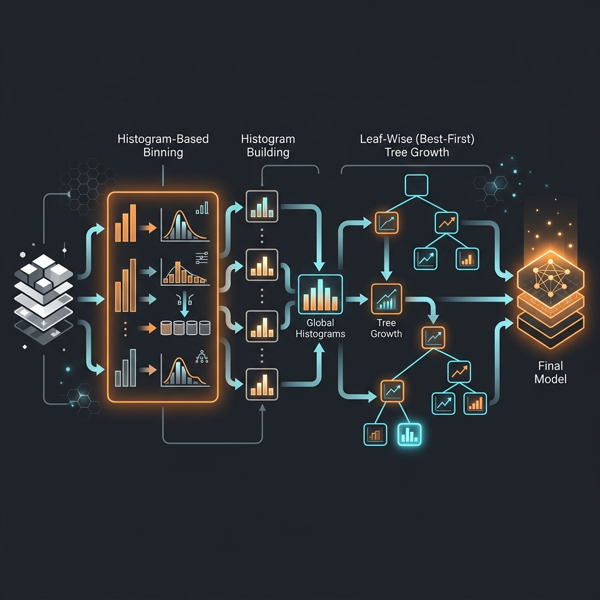

# LightGBM

> **Blazing fast, highly efficient gradient boosting.**

**What you will learn:** In this guide, you will understand the core concepts of LightGBM, how to implement it from scratch vs. using Scikit-learn, and how to answer technical interview questions.

---

## 1. What Is LightGBM?

LightGBM is a gradient boosting framework that uses tree-based learning algorithms. It is designed to be distributed and efficient with faster training speed, lower memory usage, and better accuracy. It achieves this via Histogram-based decision tree learning, Gradient-based One-Side Sampling (GOSS), and Exclusive Feature Bundling (EFB).

### Real-World Analogy
*Analogy:* Instead of measuring every single grain of sand to split them (exact greedy), you sweep the sand into 256 distinct buckets (histograms). Then you only ever evaluate splits between buckets. It is vastly faster and almost as accurate.

---

## 2. Mathematical Formulation

### Histogram Binning Variance Gain:

$$ V_j(d) = \frac{1}{n} \left( \frac{(\sum_{x_i \in A_l} g_i)^2}{n_l^j(d)} + \frac{(\sum_{x_i \in A_r} g_i)^2}{n_r^j(d)} \right) $$

| Symbol | Meaning |
|---|---|
| $V_j(d)$ | Variance gain for feature $j$ at bin $d$ |
| $g_i$ | Gradients of instances |
| $n_l, n_r$ | Count of instances in left/right bins |

### Leaf-wise Growth vs Level-wise:

LightGBM grows trees leaf-wise (Best-first), maximizing $\Delta \text{loss}$.

| Feature | Meaning |
|---|---|
| Leaf-wise | Splits the leaf with max delta loss |
| Level-wise | Splits all leaves at the same level |

---

## 3. How It Works — Step by Step



**Step 1:** Initialize the model.
**Step 2:** Iteratively fit to the target (residuals or gradient).
**Step 3:** Optimize the specific loss function using defined parameters.
**Step 4:** Combine outputs into final robust predictions.

---

## 4. Key Assumptions

| Assumption | Why It Matters | What Happens If Violated |
|---|---|---|
| Large dataset | Histogram binning shines on scale | On small data, it overfits easily |

---

## 5. When to Use / When Not to Use

| ✅ Use When | ❌ Avoid When |
|---|---|
| Millions of rows | Very small datasets (<10k rows) |
| Need rapid iteration | Extreme interpretability needed |

---

## 6. Implementation Overview

| Aspect | From Scratch (NumPy) | Library (LightGBM) |
|---|---|---|
| Binning | `np.histogram_bin_edges` | `LGBMClassifier` |

### Scikit-learn / Native Library Quick Start

```python
from lightgbm import LGBMClassifier
model = LGBMClassifier(n_estimators=100, num_leaves=31)
model.fit(X_train, y_train)
```

---

## 7. Top 5 Interview Questions

**Q1: What makes LightGBM faster than standard XGBoost?**
- Histogram-based splitting, GOSS (ignoring instances with small gradients), and EFB (bundling mutually exclusive sparse features).

**Q2: What is Leaf-wise growth?**
- Instead of splitting a tree level by level, it splits the single leaf that reduces the loss the most.

**Q3: How do you prevent overfitting in LightGBM?**
- By strictly tuning `num_leaves` (keep it smaller than $2^{\text{max\_depth}}$) and `min_data_in_leaf`.

**Q4: What is GOSS?**
- Gradient-based One-Side Sampling keeps instances with large gradients and randomly samples instances with small gradients.

**Q5: Does LightGBM handle categorical features?**
- Yes, natively. It finds optimal splits over categories without needing one-hot encoding.

---

## 8. Quick Reference Table

| Item | Detail |
|------|--------|
| **Algorithm Type** | Ensemble Learning |
| **Strengths** | Extremely high accuracy |
| **Weaknesses** | Can be complex to tune |

---

## 9. References & Further Reading

| Resource | Link |
|---|---|
| Paper | [LightGBM: A Highly Efficient Gradient Boosting Decision Tree](https://papers.nips.cc/paper/6907-lightgbm-a-highly-efficient-gradient-boosting-decision-tree) |

---

## 10. Environment & Setup

To run the accompanying Jupyter Notebook, ensure you have the following installed:
```bash
pip install numpy pandas scikit-learn matplotlib seaborn
```
For specific libraries, see the top cell of the Jupyter Notebook.
