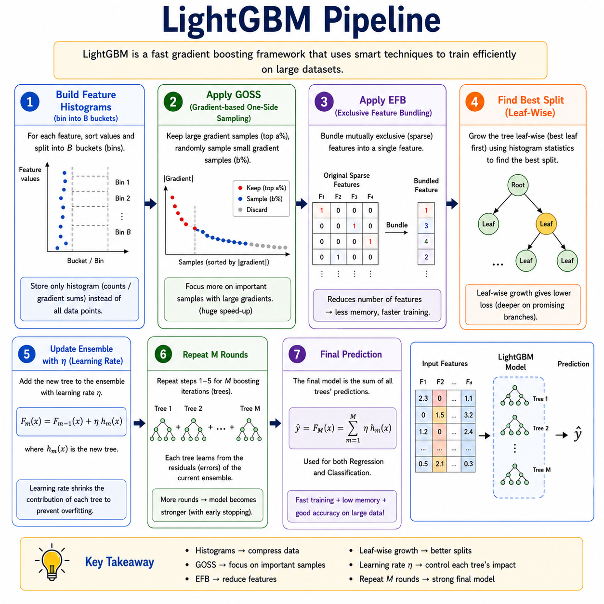
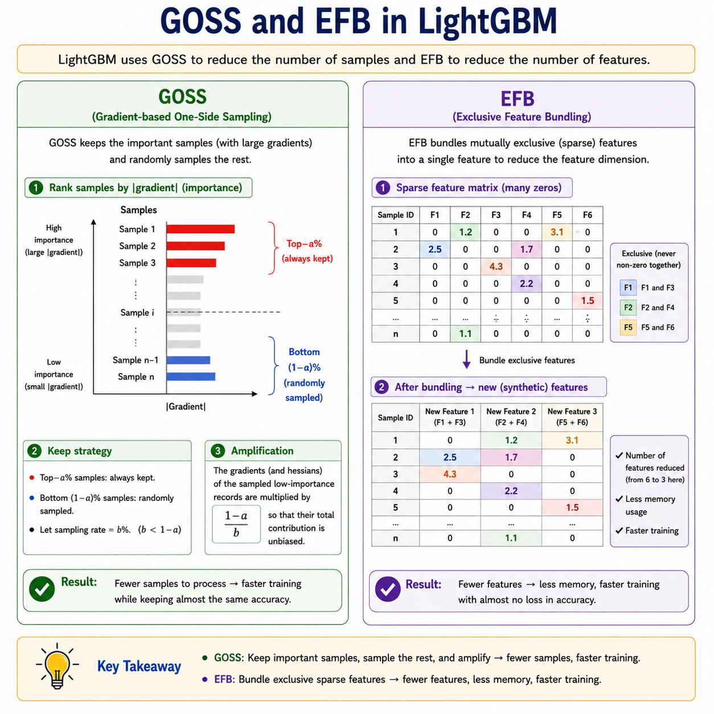
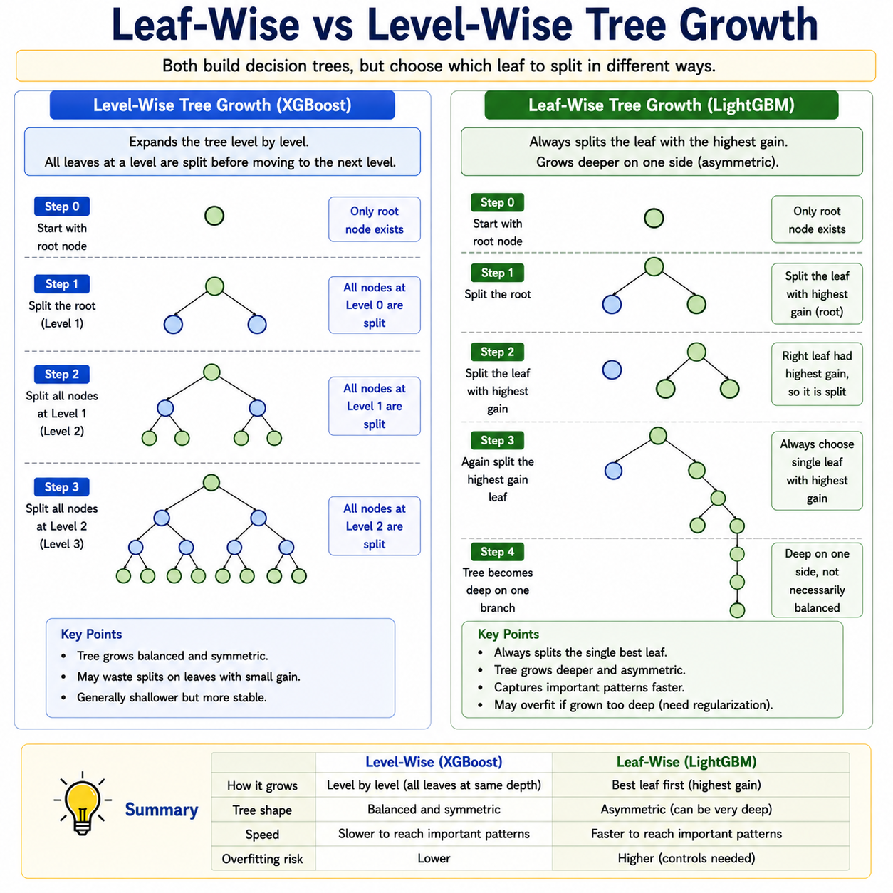

# LightGBM

> **Gradient boosting at the speed of light — built for large data, low memory, and maximum accuracy.**

**What you will learn:** In this guide, you will understand how LightGBM reimagines the gradient boosting framework using two key innovations — Gradient-based One-Side Sampling (GOSS) and Exclusive Feature Bundling (EFB) — that make it dramatically faster and more memory-efficient than traditional GBM and XGBoost without sacrificing accuracy. You will also learn its leaf-wise tree growth strategy, when to choose it over other boosting libraries in production, and how to answer LightGBM interview questions with precision.

---

## 1. What Is LightGBM?

LightGBM — short for **Light Gradient Boosting Machine** — is a high-performance gradient boosting framework developed by Microsoft Research and released in 2017. It is built on the same foundational idea as GBM and XGBoost (sequential tree boosting with gradient descent), but completely reimagines *how* the trees are built. Where traditional boosting scans every feature and every sample to find the best split at every step, LightGBM is engineered from the ground up to do far less work while finding splits that are just as good.

Think of it like two students preparing the same exam. Student A (traditional GBM) reviews every single topic from every single textbook, page by page, before deciding what to focus on. Student B (LightGBM) quickly identifies which topics they're most uncertain about (the hard samples), skips the ones they already know well, and also notices that several related topics can be studied together as one bundle. Student B finishes preparation in a fraction of the time with nearly identical exam scores. That is the philosophy of LightGBM — smart sampling and smart feature grouping over brute-force exhaustive search.

The two core innovations are: **(1) GOSS** — Gradient-based One-Side Sampling, which keeps all samples with large gradients (hard examples) and randomly discards a fraction of the easy ones, reducing training data size without losing the informative signal; and **(2) EFB** — Exclusive Feature Bundling, which identifies mutually exclusive sparse features (features that rarely take non-zero values simultaneously) and bundles them into a single feature, dramatically reducing the number of features the algorithm processes. Together, these allow LightGBM to train on datasets with millions of rows and thousands of features in minutes rather than hours.

---

## 2. Mathematical Formulation

### GOSS — Gradient-Based One-Side Sampling

LightGBM ranks all training samples by their absolute gradient magnitude $|g_i|$ and splits them into:

- **Top-$a$ set** $A$: the $a \times 100\%$ of samples with the largest gradients (always kept)
- **Low-gradient set** $B$: the remaining samples — a random fraction $b \times 100\%$ are sampled

The variance gain for a candidate split using GOSS is estimated as:

$$\tilde{V}_j(d) = \frac{1}{n}\left[\frac{\left(\sum_{x_i \in A_l} g_i + \frac{1-a}{b}\sum_{x_i \in B_l} g_i\right)^2}{n_l^j} + \frac{\left(\sum_{x_i \in A_r} g_i + \frac{1-a}{b}\sum_{x_i \in B_r} g_i\right)^2}{n_r^j}\right]$$

| Symbol | Meaning |
|--------|---------|
| $\tilde{V}_j(d)$ | Estimated variance gain for feature $j$ at split point $d$ |
| $A_l, A_r$ | Large-gradient samples routed to left/right child |
| $B_l, B_r$ | Sampled low-gradient samples routed to left/right child |
| $g_i$ | Gradient of the loss for sample $i$ — measures how wrong the current prediction is |
| $\frac{1-a}{b}$ | Amplification factor — compensates for discarding low-gradient samples to keep the estimate unbiased |
| $n_l^j, n_r^j$ | Number of samples in left and right child for split $j$ at threshold $d$ |
| $n$ | Total number of training samples |

**Significance:** The amplification factor $\frac{1-a}{b}$ is the mathematical key — it re-weights the sampled low-gradient examples so the gain estimate remains an unbiased approximation of what full-data training would compute. This means LightGBM can use far fewer samples per round without introducing systematic bias into the split decisions.

### EFB — Exclusive Feature Bundling

Two features $f_i$ and $f_j$ are *exclusive* if they rarely take non-zero values simultaneously:

$$\text{Conflict}(f_i, f_j) = \frac{|\{x : f_i(x) \neq 0 \text{ and } f_j(x) \neq 0\}|}{n}$$

Features with conflict below a threshold $\delta$ are bundled together into a single synthetic feature by offsetting their value ranges, preserving all information while halving (or more) the feature count.

### Leaf-Wise Gain (same as XGBoost, but applied leaf-wise)

$$\text{Gain} = \frac{1}{2}\left[\frac{G_L^2}{H_L+\lambda} + \frac{G_R^2}{H_R+\lambda} - \frac{(G_L+G_R)^2}{H_L+H_R+\lambda}\right] - \gamma$$

| Symbol | Meaning |
|--------|---------|
| $G_L, G_R$ | Sum of gradients in left and right child |
| $H_L, H_R$ | Sum of hessians in left and right child |
| $\lambda$ | L2 regularization on leaf weights |
| $\gamma$ | Minimum gain threshold to allow a split |

**Significance:** LightGBM applies this gain formula **leaf-wise** (best-first) rather than level-wise (breadth-first). It always expands the single leaf with the highest gain globally — this leads to deeper, more asymmetric trees that reduce loss faster per round, at the cost of higher overfitting risk on small datasets.

---

## 3. How It Works — Step by Step



**Step 1: Build a histogram for each feature.**
Instead of sorting raw feature values to find splits (like GBM/XGBoost), LightGBM first **bins** each feature into at most $B$ discrete buckets (default: 255). Split search then scans $B$ thresholds instead of $n$ raw values.

*Analogy:* Instead of checking every individual student score (0–100) to find the best pass/fail threshold, you group scores into 10-mark buckets and check only 10 boundaries.

**Step 2: Apply GOSS — keep hard samples, subsample easy ones.**
Rank all samples by $|g_i|$. Keep all top-$a$ samples unconditionally. Randomly sample a fraction $b$ of the remaining low-gradient samples. Amplify their gradients by $\frac{1-a}{b}$ to maintain an unbiased gain estimate.

*Analogy:* In your study plan, always review every topic you got badly wrong. From the topics you already know well, only spot-check a few — but count each spot-check as if it represented many easy topics.

**Step 3: Apply EFB — bundle mutually exclusive sparse features.**
Detect features that are rarely non-zero at the same time. Bundle them into one synthetic feature by shifting their value ranges. This reduces the number of histograms to build and the number of splits to evaluate.

*Analogy:* If a student is either in the morning batch or the evening batch (never both), you can represent "batch" as a single feature with two value ranges instead of two separate binary features.



**Step 4: Find the best split using leaf-wise growth.**
Scan histograms across all features and all current leaves. Pick the single leaf-feature-threshold combination with the highest gain globally. Split only that leaf — regardless of tree depth.

*Analogy:* Instead of completing one full floor of a building before starting the next, you always add the room that gives the most structural value — anywhere in the building.

**Step 5: Update predictions and gradients.**
Add the new tree to the ensemble scaled by learning rate $\eta$. Recompute gradients $g_i$ and hessians $h_i$ for the updated predictions.

**Step 6: Repeat Steps 2–5 for $M$ rounds.**
Each round targets residuals of the current ensemble. Errors shrink progressively.



**Step 7: Final prediction.**
Sum all tree outputs scaled by $\eta$. Apply sigmoid for binary classification, softmax for multi-class.

---

## 4. Key Assumptions

| Assumption | Why It Matters | What Happens If Violated |
|------------|----------------|--------------------------|
| Large-gradient samples carry most of the information | GOSS is valid only if high-gradient points drive split decisions | On very clean, uniform data, GOSS provides little benefit and may slightly hurt accuracy |
| Features have many zero or near-zero values (sparse) | EFB is most effective on sparse feature spaces | On dense, fully informative features, EFB finds few bundles and offers minimal speedup |
| Dataset is large (thousands to millions of rows) | Histogram binning and GOSS pay off only at scale | On tiny datasets (< 1K rows), LightGBM may overfit faster than XGBoost or GBM |
| Loss function is twice-differentiable | Gradient and hessian computation is required every round | Non-smooth losses break the optimization; use approximations |
| Features are on a reasonable numeric or encoded scale | Histogram binning needs meaningful value ranges to create useful buckets | Extreme outliers collapse all bins into one range; clip or log-transform inputs |

---

## 5. When to Use / When Not to Use

| ✅ Use LightGBM When | ❌ Avoid LightGBM When |
|---------------------|----------------------|
| Dataset has millions of rows and/or thousands of features | Dataset is tiny (< 1K rows) — leaf-wise growth overfits easily |
| Training speed and memory efficiency are critical | Full model interpretability is the primary requirement |
| High-cardinality categorical features are present | Raw images, audio, or unstructured text without feature engineering |
| You need GPU-accelerated gradient boosting | You need a simple, low-hyperparameter baseline (use GBM first) |
| Kaggle competitions with large tabular datasets | Features are all dense and continuous with no sparsity (EFB gives no benefit) |
| You want built-in categorical feature support | Strict reproducibility across platforms is required (leaf-wise is sensitive to seed) |

---

## 6. Implementation Overview

| Aspect | From Scratch (NumPy) | Library (LightGBM / Scikit-learn API) |
|--------|---------------------|---------------------------------------|
| **Histogram building** | Bin each feature into $B$ buckets manually | Controlled by `max_bin` parameter |
| **GOSS sampling** | Sort by $\|g_i\|$, keep top-$a$, sample $b$ from rest | `data_sample_strategy='goss'`, `top_rate`, `other_rate` |
| **EFB bundling** | Build conflict graph, greedy bundle assignment | Enabled by default; `max_conflict_rate` controls threshold |
| **Leaf-wise growth** | Always split the highest-gain leaf globally | `num_leaves` controls max leaves; set `min_data_in_leaf` |
| **Gradient & hessian** | Compute per round for chosen loss | Automatic for all built-in objectives |
| **Learning rate** | Multiply each tree output by $\eta$ | `learning_rate` parameter |
| **Categorical features** | One-hot encode manually | Pass column names via `categorical_feature` — handled natively |
| **Use case** | Research and custom loss exploration | All production, large-scale, and competition use |

### LightGBM Scikit-learn API Quick Start

```python
import lightgbm as lgb
from sklearn.datasets import make_classification
from sklearn.model_selection import train_test_split
from sklearn.metrics import accuracy_score, roc_auc_score

# Generate a binary classification dataset
X, y = make_classification(n_samples=50000, n_features=30, random_state=42)
X_train, X_test, y_train, y_test = train_test_split(
    X, y, test_size=0.2, random_state=42
)

# Build LightGBM classifier using the Scikit-learn API
model = lgb.LGBMClassifier(
    n_estimators=500,            # Number of boosting rounds
    learning_rate=0.05,          # Shrinkage factor — smaller = more robust
    num_leaves=63,               # Max leaves per tree (controls complexity)
    max_depth=-1,                # -1 = no limit; num_leaves governs depth instead
    subsample=0.8,               # Row subsampling fraction per tree
    colsample_bytree=0.8,        # Feature subsampling fraction per tree
    min_child_samples=20,        # Minimum samples per leaf (regularization)
    reg_alpha=0.1,               # L1 regularization on leaf weights
    reg_lambda=1.0,              # L2 regularization on leaf weights
    n_jobs=-1,                   # Use all CPU cores
    random_state=42
)

# Train with early stopping
callbacks = [lgb.early_stopping(stopping_rounds=30), lgb.log_evaluation(50)]
model.fit(
    X_train, y_train,
    eval_set=[(X_test, y_test)],
    callbacks=callbacks
)

# Evaluate
y_pred  = model.predict(X_test)
y_proba = model.predict_proba(X_test)[:, 1]
print(f"Accuracy : {accuracy_score(y_test, y_pred):.4f}")
print(f"ROC-AUC  : {roc_auc_score(y_test, y_proba):.4f}")
```

---

## 7. Top 5 Interview Questions

**Q1: What are GOSS and EFB, and why do they make LightGBM faster?**
- GOSS: keeps all high-gradient (hard) samples, randomly subsamples low-gradient (easy) ones → fewer samples per round
- EFB: bundles mutually exclusive sparse features into one synthetic feature → fewer histograms to build
- Together: reduce both the sample axis and the feature axis of the computation
- Amplification factor $\frac{1-a}{b}$ in GOSS ensures the gain estimate stays unbiased despite subsampling

**Q2: What is leaf-wise growth and how is it different from level-wise growth?**
- Level-wise (XGBoost/GBM): expand all leaves at the current depth before going deeper — balanced trees
- Leaf-wise (LightGBM): always expand the single leaf with the maximum gain globally — asymmetric trees
- Leaf-wise reduces loss faster per round; uses `num_leaves` not `max_depth` to control complexity
- Risk: leaf-wise can overfit on small datasets — mitigate with `min_data_in_leaf` and `num_leaves`

**Q3: How does LightGBM handle categorical features natively?**
- Converts categories to integer codes internally — no one-hot encoding needed
- Finds optimal binary splits over category subsets using an efficient histogram-based method
- Pass column indices or names via `categorical_feature` parameter
- Avoids the high-dimensionality problem of one-hot encoding for high-cardinality features

**Q4: When would you choose XGBoost over LightGBM?**
- XGBoost: better on small-to-medium datasets; level-wise growth is less prone to overfitting
- LightGBM: significantly faster on large datasets (millions of rows); better memory efficiency
- XGBoost has more mature tooling for exact split finding; LightGBM uses approximate histogram splits
- In practice: try both and cross-validate; accuracy difference is often marginal, speed difference is large

**Q5: What is the role of `num_leaves` in LightGBM and how do you tune it?**
- `num_leaves` is the primary complexity control — replaces `max_depth` for leaf-wise trees
- A tree of depth $D$ has at most $2^D$ leaves; set `num_leaves` $< 2^{max\_depth}$ to avoid overfitting
- Rule of thumb: `num_leaves` between 20 and 300; start with 31 (default), increase for larger datasets
- Always pair `num_leaves` with `min_data_in_leaf` — larger `num_leaves` requires larger `min_data_in_leaf`

---

## 8. Quick Reference Table

| Item | Detail |
|------|--------|
| **Algorithm Type** | Gradient Boosting (Leaf-Wise Sequential Ensemble with GOSS + EFB) |
| **Learning Type** | Supervised — Classification, Regression, Ranking, Multi-output |
| **Strengths** | Extremely fast training, low memory, native categorical support, GPU-ready, handles large datasets |
| **Weaknesses** | Prone to overfitting on small datasets, more hyperparameters than GBM, less interpretable than linear models |
| **Time Complexity** | $O(M \cdot B \cdot \tilde{n} \cdot \tilde{d})$ — $M$ rounds, $B$ bins, $\tilde{n}$ GOSS-sampled rows, $\tilde{d}$ EFB-bundled features |
| **Space Complexity** | $O(B \cdot d + M \cdot L)$ — histogram storage + $M$ trees with $L$ leaves each |
| **Key Hyperparameters** | `num_leaves`, `learning_rate`, `n_estimators`, `min_data_in_leaf`, `subsample`, `colsample_bytree`, `reg_alpha`, `reg_lambda` |
| **Evaluation Metrics** | RMSE / MAE (regression), AUC-ROC / Log-loss / F1-Score (classification), NDCG (ranking) |

---

## 9. References & Further Reading

| Resource | Link |
|----------|------|
| 📄 **Original Paper** | Ke et al. (2017) — *LightGBM: A Highly Efficient Gradient Boosting Decision Tree* — [Read on NeurIPS](https://papers.nips.cc/paper/2017/hash/6449f44a102fde848669bdd9eb6b76fa-Abstract.html) |
| 📘 **Best Tutorial** | Towards Data Science — [LightGBM: A Complete Guide](https://towardsdatascience.com/lightgbm-complete-guide-by-example-36e2c3674893) |
| 📓 **Kaggle Notebook** | [LightGBM Starter — Complete Walkthrough](https://www.kaggle.com/code/prashant111/lightgbm-classifier-in-python) |
| 📚 **Official Docs** | LightGBM Documentation — [lightgbm.readthedocs.io](https://lightgbm.readthedocs.io/en/latest/) |
| 🎥 **Additional Learning** | Abhishek Thakur — [LightGBM Tutorial on YouTube](https://www.youtube.com/watch?v=pPTi8K2YKU8) |
