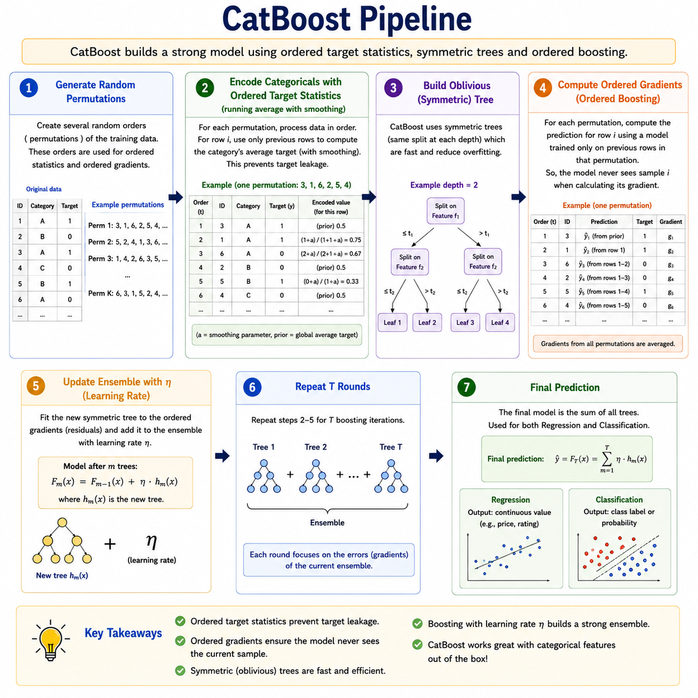
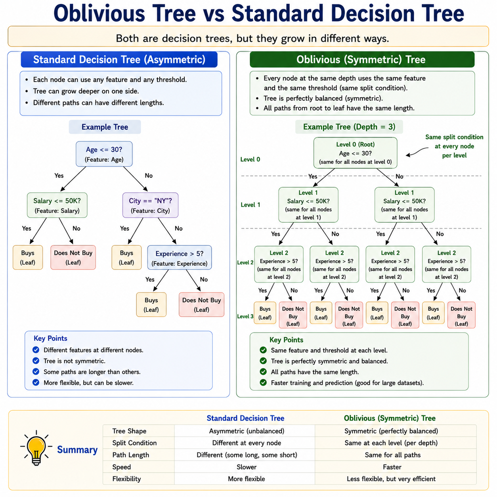
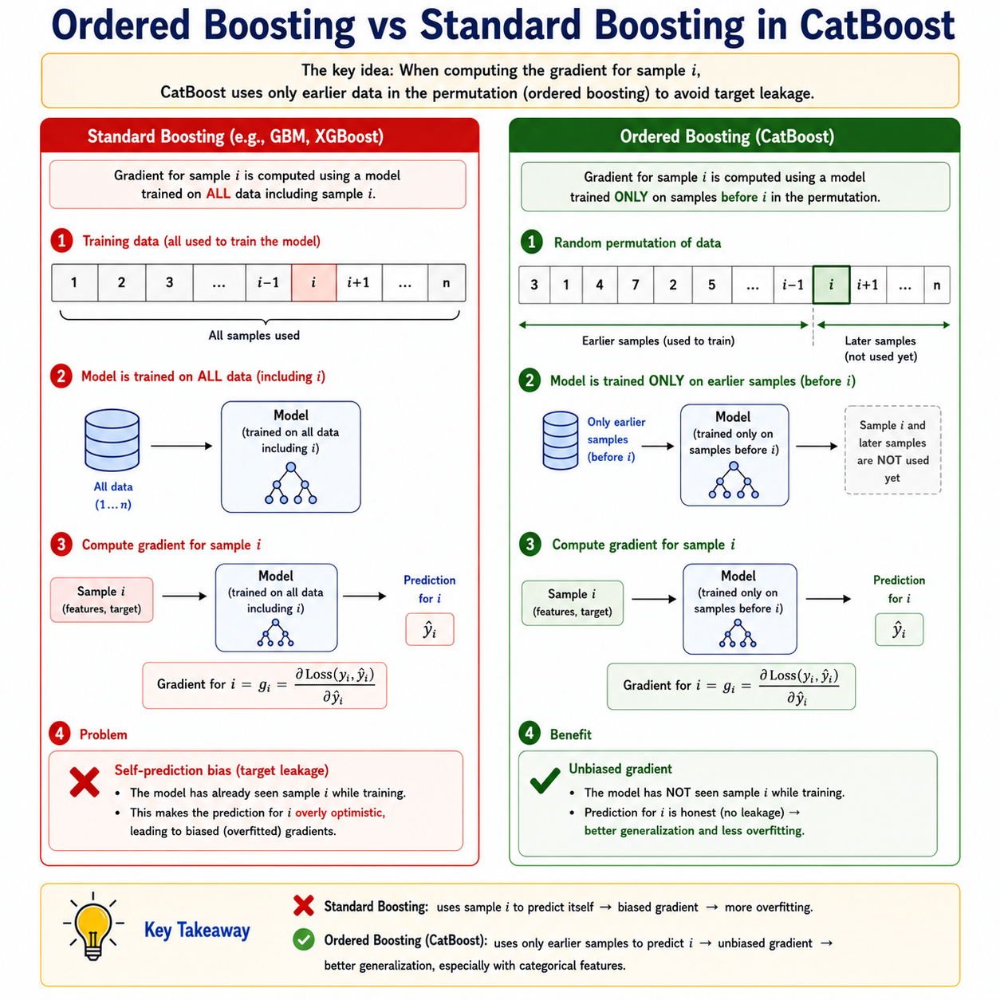

# CatBoost

> **Gradient boosting that handles categorical features natively — no preprocessing required.**

**What you will learn:** In this guide, you will understand how CatBoost solves the fundamental problem of target leakage in categorical feature encoding using Ordered Boosting and a novel Ordered Target Statistics approach — making it the most robust gradient boosting library for real-world datasets with mixed feature types. You will also learn its unique training mechanics, when to deploy it over XGBoost or LightGBM, and how to answer CatBoost interview questions with depth.

---

## 1. What Is CatBoost?

CatBoost — short for **Categorical Boosting** — is a gradient boosting library developed by Yandex and open-sourced in 2017. Like GBM, XGBoost, and LightGBM, it builds an ensemble of decision trees sequentially, where each tree corrects the residual errors of the previous ones. But CatBoost was designed to solve a specific, painful problem that every data scientist faces with real-world data: **how to correctly handle categorical features** (like city names, product IDs, or job titles) without manual encoding that leaks information or distorts statistics.

To understand why this matters, consider a simple scenario. You want to encode the feature "City" using target encoding — replacing each city name with the average sale price for that city. If you compute this average using the full training set and then train on the same data, the model "sees" its own answer during training — a subtle form of data leakage that makes the model look better than it really is. Traditional methods like one-hot encoding avoid this but explode feature dimensionality for high-cardinality categories. CatBoost solves this elegantly using **Ordered Target Statistics**, which computes category statistics only from data points that came *before* the current sample in a randomly shuffled order — exactly like how you'd compute a running average.

The second major innovation in CatBoost is **Ordered Boosting** — a modification to the standard gradient boosting algorithm that prevents a similar leakage problem in the gradient computation itself. In standard GBM, the gradients used to fit each tree are computed on the same data used to train that tree, which introduces subtle bias. Ordered Boosting maintains multiple model versions trained on growing subsets of data, ensuring each gradient is computed using a model that has never seen that particular sample. The result is a model that generalizes better right out of the box, often requiring less tuning than XGBoost or LightGBM.

---

## 2. Mathematical Formulation

### Ordered Target Statistics (for categorical encoding)

For a training sample $(x_i, y_i)$ with categorical feature value $c$, its encoded value is computed as:

$$\hat{x}_i^k = \frac{\sum_{j < \sigma^{-1}(i)} \mathbf{1}[x_{\sigma(j)}^k = c] \cdot y_{\sigma(j)} + a \cdot p}{\sum_{j < \sigma^{-1}(i)} \mathbf{1}[x_{\sigma(j)}^k = c] + a}$$

| Symbol | Meaning |
|--------|---------|
| $\hat{x}_i^k$ | Encoded numeric value for sample $i$, categorical feature $k$ |
| $\sigma$ | A random permutation of the training data (shuffled ordering) |
| $\sigma^{-1}(i)$ | The position of sample $i$ in the permutation |
| $j < \sigma^{-1}(i)$ | Only samples that appear *before* sample $i$ in the permutation |
| $\mathbf{1}[x_{\sigma(j)}^k = c]$ | Indicator: 1 if the $j$-th sample has the same category $c$ |
| $y_{\sigma(j)}$ | Target value of the $j$-th sample |
| $a$ | Smoothing parameter — prevents unreliable estimates from rare categories |
| $p$ | Prior probability — global target mean, used as a fallback for unseen categories |

**Significance:** This formula computes a "running average" of the target for each category value, using only the data points that appeared earlier in the shuffled order. The smoothing term $a \cdot p$ prevents extreme estimates when a category has very few examples (e.g., a city appearing only once gets pulled toward the global average). Multiple random permutations are used during training to reduce variance from any single ordering.

### Ordered Boosting — Gradient Computation

At boosting round $t$, the gradient for sample $i$ is computed using model $M^{(t-1, \sigma^{-1}(i))}$ — a model trained only on the first $\sigma^{-1}(i) - 1$ samples in the current permutation:

$$g_i^t = -\frac{\partial\, l(y_i,\ M^{(t-1,\ \sigma^{-1}(i))}(x_i))}{\partial\, M^{(t-1,\ \sigma^{-1}(i))}(x_i)}$$

| Symbol | Meaning |
|--------|---------|
| $g_i^t$ | Gradient for sample $i$ at round $t$ |
| $l(\cdot)$ | Differentiable loss function (log-loss, RMSE, etc.) |
| $M^{(t-1,\ \sigma^{-1}(i))}$ | A version of the model at round $t-1$ trained on all samples before $i$ in permutation $\sigma$ |

**Significance:** By using a model that has never seen sample $i$ to compute $i$'s gradient, CatBoost eliminates the prediction bias that standard GBM introduces. This is especially impactful on small and medium datasets where bias from self-prediction is most harmful.

---

## 3. How It Works — Step by Step



**Step 1: Generate random permutations of the training data.**
CatBoost creates several random orderings of the training samples. These permutations serve two purposes: computing ordered target statistics for encoding, and computing unbiased gradients for each sample.

*Analogy:* Before a fair talent contest, the organizers shuffle the order of performers randomly so no judge is biased by seeing the same performer twice in a fixed context.

**Step 2: Encode categorical features using Ordered Target Statistics.**
For each categorical feature, replace each category value with its running-average target statistic computed only from prior samples in the current permutation. Smooth the estimate with the global prior $p$ weighted by $a$.

*Analogy:* When rating a restaurant, you only consider reviews written before you visited — not your own visit — so your rating isn't circular.

**Step 3: Build a symmetric (oblivious) decision tree.**
Unlike GBM/XGBoost/LightGBM which use standard asymmetric trees, CatBoost builds **oblivious trees** — trees where the same feature and threshold are used for splitting at every node on the same depth level. This means the entire tree is described by a list of $D$ (feature, threshold) pairs — one per level.

*Analogy:* A questionnaire where everyone at the same stage answers the same question — not a branching interview where each person gets customized questions.



**Step 4: Compute gradients using Ordered Boosting.**
For each sample $i$, compute the gradient using the model version trained on all samples that appeared *before* $i$ in the permutation — not the full model. This prevents the self-prediction bias that standard GBM suffers from.

*Analogy:* A teacher grades each student's test using only what was taught *before* that student enrolled — never using content the student helped develop.

**Step 5: Fit the oblivious tree to the ordered gradients.**
Use the computed gradients to find the best (feature, threshold) pair at each level of the symmetric tree. Leaf values are computed analytically to minimize the loss.

**Step 6: Update the ensemble with learning rate $\eta$.**
Add the new tree to the ensemble: $F_t(x) = F_{t-1}(x) + \eta \cdot h_t(x)$. Recompute ordered gradients for the next round.



**Step 7: Repeat Steps 2–6 for $T$ rounds.**
Each round refines the predictions by targeting the remaining residuals with a new symmetric tree. CatBoost uses early stopping on a validation set to halt training when performance plateaus.

**Step 8: Final prediction.**
Sum all tree outputs scaled by $\eta$. Apply sigmoid for binary classification, softmax for multi-class, identity for regression.

---

## 4. Key Assumptions

| Assumption | Why It Matters | What Happens If Violated |
|------------|----------------|--------------------------|
| Categorical features are declared explicitly | Ordered Target Statistics are applied only to declared categoricals | Undeclared categoricals are treated as numeric — encoding quality degrades badly |
| Sufficient training samples per category value | Smoothing with prior $p$ works best when rare categories exist but aren't dominant | Very rare categories default entirely to the prior; model loses discrimination power for those categories |
| Random permutations approximate the true data ordering | Ordered TS assumes a temporal or random ordering preserves statistical independence | If data has strong temporal drift, a fixed time-based ordering is better than random permutations |
| Loss function is differentiable | Ordered Boosting requires gradient computation at each round | Non-smooth losses break gradient computation; use surrogate differentiable losses |
| Dataset is large enough for ordered statistics | Running averages for Ordered TS need enough prior samples to be stable | On very small datasets (< 500 rows), early-in-permutation samples have unstable encodings; use cross-validation encoding instead |

---

## 5. When to Use / When Not to Use

| ✅ Use CatBoost When | ❌ Avoid CatBoost When |
|---------------------|----------------------|
| Dataset has many high-cardinality categorical features | All features are already numeric and well-preprocessed |
| You want to avoid manual encoding pipelines (target encoding, OHE) | Dataset has millions of rows — LightGBM trains faster at that scale |
| Small-to-medium datasets where bias matters most | Real-time inference with strict latency — oblivious trees add overhead vs stumps |
| You need strong out-of-the-box performance with minimal tuning | You need highly customized loss functions — CatBoost has fewer built-in objectives |
| Ranking tasks (CatBoost has native YetiRank support) | Full transparency and interpretability are required |
| GPU training is available and needed | Team is already using XGBoost/LightGBM with well-tuned pipelines |

---

## 6. Implementation Overview

| Aspect | From Scratch (NumPy) | Library (CatBoost / Scikit-learn API) |
|--------|---------------------|---------------------------------------|
| **Permutation generation** | Randomly shuffle index arrays manually | Handled internally; controlled by `random_seed` |
| **Ordered Target Statistics** | Implement running-average encoding with prior smoothing | Pass column indices to `cat_features` parameter |
| **Oblivious tree building** | Enforce same split at every level of the tree manually | `depth` parameter controls number of levels |
| **Ordered gradient computation** | Maintain multiple model versions per permutation | Enabled by default via `boosting_type='Ordered'` |
| **Leaf value calculation** | Analytical closed-form per leaf | Automatic |
| **Learning rate** | Multiply each tree output by $\eta$ before adding | `learning_rate` parameter |
| **Early stopping** | Track validation loss; stop when no improvement for $k$ rounds | `early_stopping_rounds` parameter |
| **Use case** | Research into ordered statistics; custom categorical encoders | All production, real-world messy data, competitions |

### CatBoost Scikit-learn API Quick Start

```python
from catboost import CatBoostClassifier
from sklearn.datasets import make_classification
from sklearn.model_selection import train_test_split
from sklearn.metrics import accuracy_score, roc_auc_score
import pandas as pd
import numpy as np

# Generate dataset and add synthetic categorical features
X, y = make_classification(n_samples=10000, n_features=15, random_state=42)
df = pd.DataFrame(X, columns=[f'num_feat_{i}' for i in range(15)])
df['city']    = np.random.choice(['Mumbai', 'Delhi', 'Hyderabad', 'Chennai'], size=10000)
df['product'] = np.random.choice(['A', 'B', 'C', 'D', 'E'], size=10000)

cat_features = ['city', 'product']   # Declare categoricals explicitly
X_train, X_test, y_train, y_test = train_test_split(df, y, test_size=0.2, random_state=42)

# Build CatBoost classifier
model = CatBoostClassifier(
    iterations=500,              # Number of boosting rounds (trees)
    learning_rate=0.05,          # Shrinkage factor
    depth=6,                     # Depth of oblivious trees (controls leaves = 2^depth)
    cat_features=cat_features,   # No encoding needed — CatBoost handles it
    l2_leaf_reg=3.0,             # L2 regularization on leaf values
    border_count=128,            # Number of histogram bins for numeric features
    boosting_type='Ordered',     # Ordered Boosting (default) — use 'Plain' for large data
    eval_metric='AUC',
    early_stopping_rounds=30,
    random_seed=42,
    verbose=50
)

# Train the model
model.fit(X_train, y_train, eval_set=(X_test, y_test))

# Evaluate
y_pred  = model.predict(X_test)
y_proba = model.predict_proba(X_test)[:, 1]
print(f"Accuracy : {accuracy_score(y_test, y_pred):.4f}")
print(f"ROC-AUC  : {roc_auc_score(y_test, y_proba):.4f}")
```

---

## 7. Top 5 Interview Questions

**Q1: What problem does CatBoost solve that XGBoost and LightGBM don't?**
- Categorical feature encoding without target leakage — no manual OHE or target encoding needed
- Standard target encoding uses the full training set → leaks future labels into training
- Ordered Target Statistics uses only prior samples in a permutation → statistically unbiased
- Also solves gradient bias via Ordered Boosting — standard GBM computes gradients on the same data used to train the model

**Q2: What is an oblivious tree and why does CatBoost use it?**
- Oblivious (symmetric) tree: same (feature, threshold) split applied at every node on the same depth level
- Entire tree described by $D$ split conditions (one per depth level) → very fast inference
- Acts as a regularizer — oblivious trees are simpler than asymmetric trees, reducing overfitting
- Trade-off: less expressive per tree, so more trees may be needed; compensated by faster training per tree

**Q3: What is Ordered Boosting and how does it reduce bias?**
- Standard GBM: gradients computed using a model trained on all data including sample $i$ → self-prediction bias
- Ordered Boosting: for sample $i$, gradient computed using a model trained only on samples before $i$ in permutation
- This means the model used to evaluate $i$ has never seen $i$ → no optimistic bias
- Particularly beneficial on small/medium datasets; CatBoost uses `Plain` mode (standard) for very large data as a speed trade-off

**Q4: How does CatBoost handle high-cardinality categorical features?**
- Uses Ordered Target Statistics — running-average encoding with smoothing prior $a \cdot p$
- Smoothing pulls rare-category estimates toward the global mean → prevents extreme values for low-count categories
- Internally creates combinations of categorical features (feature interactions) up to a configurable order
- No need for label encoding, binary encoding, or OHE — just pass column names to `cat_features`

**Q5: When would you choose CatBoost over LightGBM for a production problem?**
- CatBoost: dataset has many categorical features, especially high-cardinality ones; small-to-medium data size
- LightGBM: dataset is very large (millions of rows); training speed is the bottleneck; features are mostly numeric
- CatBoost often wins out of the box with minimal tuning; LightGBM wins on training time at scale
- CatBoost has native ranking support (YetiRank); LightGBM has native support too but with different objectives
- If the team lacks preprocessing pipelines for categoricals, CatBoost saves significant engineering time

---

## 8. Quick Reference Table

| Item | Detail |
|------|--------|
| **Algorithm Type** | Gradient Boosting with Ordered Boosting + Oblivious Trees |
| **Learning Type** | Supervised — Classification, Regression, Ranking |
| **Strengths** | Native categorical handling, no target leakage, strong out-of-box performance, GPU support, fast inference |
| **Weaknesses** | Slower training than LightGBM on large datasets, fewer built-in objectives, larger model size |
| **Time Complexity** | $O(T \cdot 2^D \cdot n \cdot d)$ — $T$ trees, depth $D$, $n$ samples, $d$ features (oblivious splits) |
| **Space Complexity** | $O(T \cdot 2^D + n \cdot d)$ — tree storage + training data; multiple permutation models add overhead |
| **Key Hyperparameters** | `iterations`, `learning_rate`, `depth`, `l2_leaf_reg`, `border_count`, `cat_features`, `boosting_type` |
| **Evaluation Metrics** | AUC-ROC / Log-loss / Accuracy (classification), RMSE / MAE (regression), NDCG / MAP (ranking) |

---

## 9. References & Further Reading

| Resource | Link |
|----------|------|
| 📄 **Original Paper** | Prokhorenkova et al. (2018) — *CatBoost: Unbiased Boosting with Categorical Features* — [Read on NeurIPS](https://papers.nips.cc/paper/2018/hash/14491b756b3a51daac41c24863285549-Abstract.html) |
| 📘 **Best Tutorial** | Towards Data Science — [CatBoost: A Complete Guide](https://towardsdatascience.com/catboost-regression-in-6-minutes-3487f3e5b329) |
| 📓 **Kaggle Notebook** | [CatBoost Starter with Categorical Features](https://www.kaggle.com/code/ekami66/detailed-exploratory-data-analysis-with-python) |
| 📚 **Official Docs** | CatBoost Documentation — [catboost.ai/docs](https://catboost.ai/en/docs/) |
| 🎥 **Additional Learning** | Yandex CatBoost Talk — [CatBoost at NeurIPS on YouTube](https://www.youtube.com/watch?v=8o0e-r0B5xQ) |
