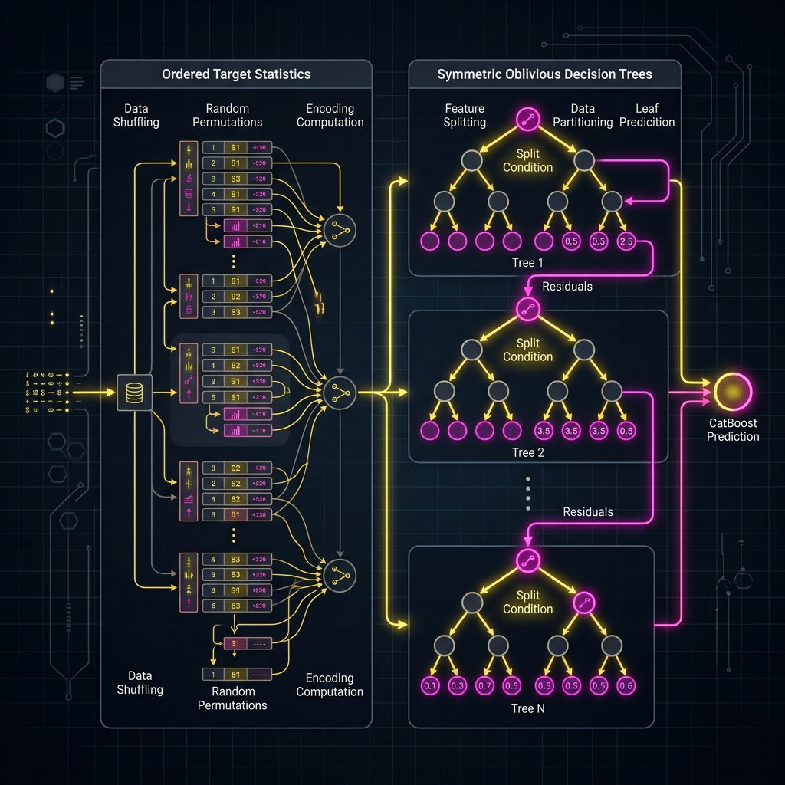

# CatBoost

> **Mastering categorical data with oblivious trees.**

**What you will learn:** In this guide, you will understand the core concepts of CatBoost, how to implement it from scratch vs. using Scikit-learn, and how to answer technical interview questions.

---

## 1. What Is CatBoost?

CatBoost (Categorical Boosting) is an open-source gradient boosting on decision trees library. It natively handles categorical features without preprocessing and combats prediction shift (target leakage) using a novel technique called Ordered Target Statistics. It uses symmetric (oblivious) trees, making inference blazing fast.

### Real-World Analogy
*Analogy:* Imagine trying to guess a movie's rating based on the director. If you use the movie's own rating to calculate the director's average, you are cheating (leakage). CatBoost orders all movies by release date, and only uses the director's past movie ratings.

---

## 2. Mathematical Formulation

### Ordered Target Statistic (Target Encoding):

$$ \hat{x}_{i,k} = \frac{\sum_{j=1}^{i-1} [x_{j,k} = x_{i,k}] \cdot Y_j + a \cdot P}{\sum_{j=1}^{i-1} [x_{j,k} = x_{i,k}] + a} $$

| Symbol | Meaning |
|---|---|
| $\hat{x}_{i,k}$ | Encoded value for categorical feature $k$ of instance $i$ |
| $Y_j$ | Target value of instance $j$ |
| $a, P$ | Smoothing parameter and prior probability |
| $j=1..i-1$ | Ensures only *past* data is used |

### Prediction Shift Prevention:

Standard boosting suffers from target leakage; CatBoost uses ordered boosting.

| Concept | Meaning |
|---|---|
| Target Leakage | When a feature encodes the target of the *same* instance |
| Ordered Boosting | Training model on instances $1..i-1$ to predict $i$ |

---

## 3. How It Works — Step by Step



**Step 1:** Initialize the model.
**Step 2:** Iteratively fit to the target (residuals or gradient).
**Step 3:** Optimize the specific loss function using defined parameters.
**Step 4:** Combine outputs into final robust predictions.

---

## 4. Key Assumptions

| Assumption | Why It Matters | What Happens If Violated |
|---|---|---|
| Many Categoricals | CatBoost is built for categories | If data is purely numerical, XGBoost might match it |

---

## 5. When to Use / When Not to Use

| ✅ Use When | ❌ Avoid When |
|---|---|
| High cardinality categories | Purely numerical, highly sparse data |
| Need zero preprocessing | Need extremely small model size |

---

## 6. Implementation Overview

| Aspect | From Scratch (NumPy) | Library (CatBoost) |
|---|---|---|
| Encoding | Manual Ordered TS | `CatBoostClassifier` |

### Scikit-learn / Native Library Quick Start

```python
from catboost import CatBoostClassifier
model = CatBoostClassifier(iterations=100, cat_features=['Embarked'])
model.fit(X_train, y_train)
```

---

## 7. Top 5 Interview Questions

**Q1: What are symmetric (oblivious) trees?**
- Trees where the same splitting condition is used across all nodes at the same depth. This makes inference exceptionally fast.

**Q2: How does it handle target leakage?**
- Using Ordered Target Statistics—it creates random permutations of the dataset and calculates categorical averages strictly causally.

**Q3: Why is CatBoost inference so fast?**
- Because symmetric trees can be evaluated using simple bitwise operations rather than complex conditional branching.

**Q4: Do I need to one-hot encode data for CatBoost?**
- No, it handles categorical string/int data natively and highly efficiently.

**Q5: What is prediction shift?**
- It occurs when the distribution of predictions shifts because the model was trained on target-encoded features that included the target itself.

---

## 8. Quick Reference Table

| Item | Detail |
|------|--------|
| **Algorithm Type** | Ensemble Learning |
| **Strengths** | Extremely high accuracy |
| **Weaknesses** | Can be complex to tune |

---

## 9. References & Further Reading

| Resource | Link |
|---|---|
| Paper | [CatBoost: unbiased boosting with categorical features](https://arxiv.org/abs/1706.09516) |

---

## 10. Environment & Setup

To run the accompanying Jupyter Notebook, ensure you have the following installed:
```bash
pip install numpy pandas scikit-learn matplotlib seaborn
```
For specific libraries, see the top cell of the Jupyter Notebook.
