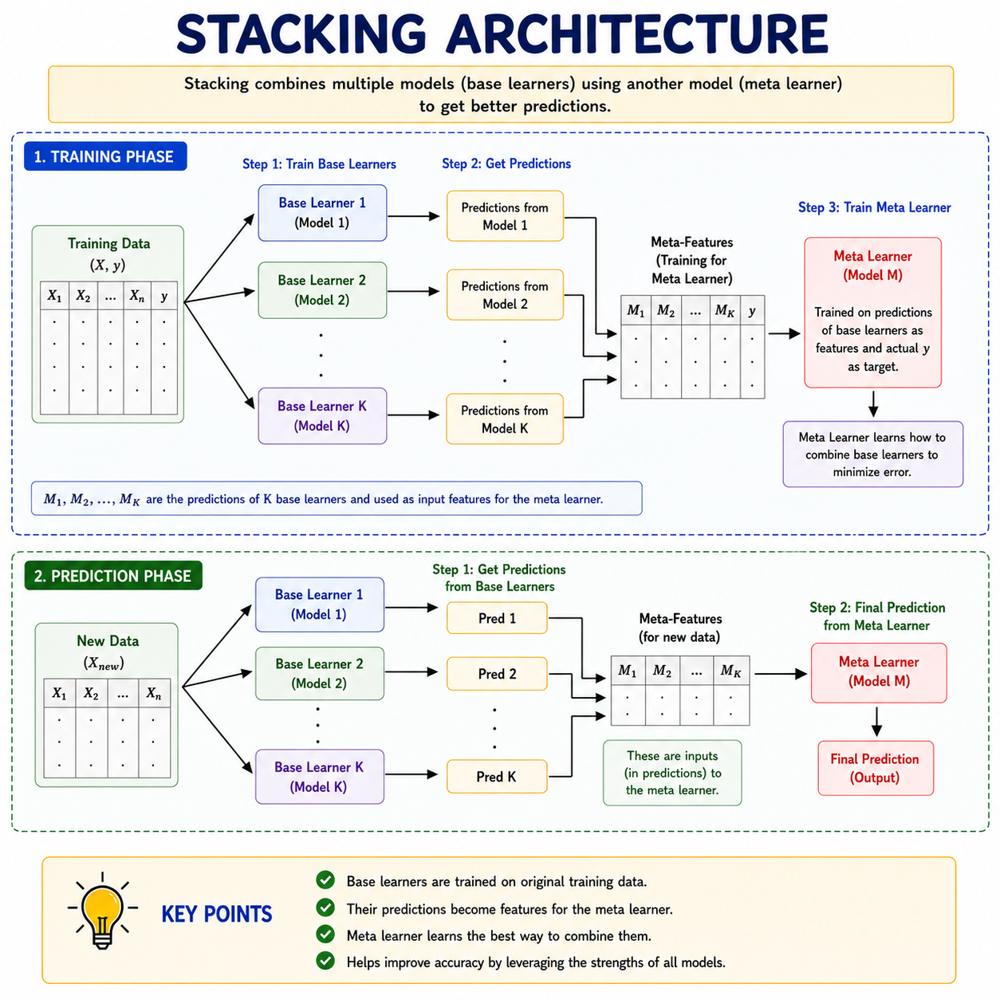
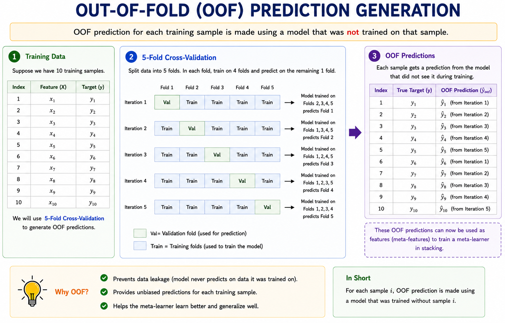
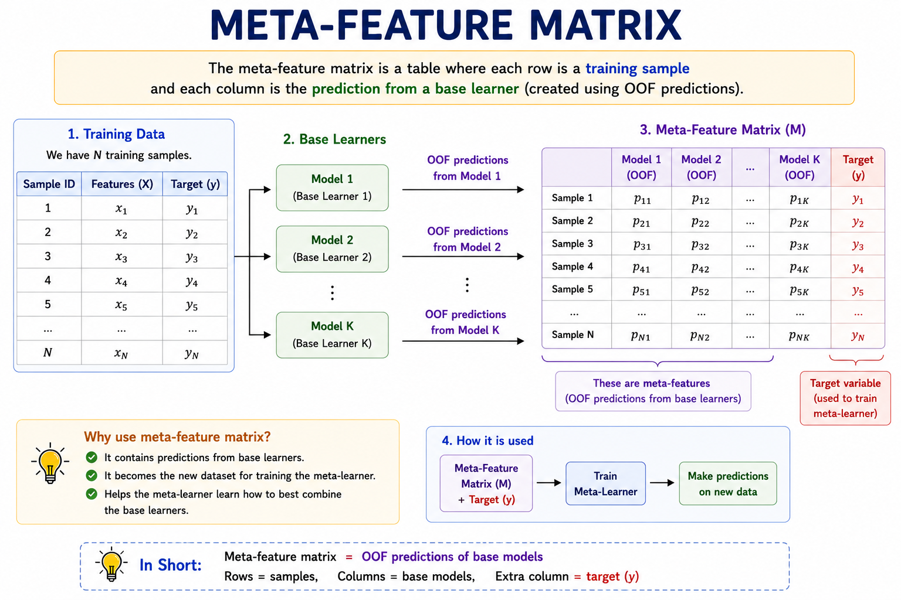

# Stacking

> **Turning diverse model predictions into a single learned meta-decision — smarter than any one model alone.**

**What you will learn:** In this guide, you will understand how Stacking (Stacked Generalization) combines predictions from multiple heterogeneous base models by training a second-level meta-learner that intelligently blends their outputs into a superior final prediction. You will also learn how to implement it correctly (avoiding data leakage), when to use it in production, and how to confidently answer deep interview questions on the topic.

---

## 1. What Is Stacking?

Stacking — short for **Stacked Generalization** — is an ensemble learning technique introduced by David Wolpert in 1992. Rather than training multiple copies of the same model (like Bagging) or fixing errors sequentially (like Boosting), Stacking trains several **fundamentally different** models in parallel and then trains a second model — the **meta-learner** — to figure out the best way to combine their predictions. The result is a two-layer architecture where the first layer produces "opinions" and the second layer learns *how much to trust each opinion*.

Think of it like a panel of doctors diagnosing a patient. A radiologist studies the X-rays, a cardiologist reviews the ECG, and a neurologist examines the reflex tests. Each specialist gives their diagnosis independently. Then a senior consultant — who knows the track record of each specialist and when each one tends to be right — makes the final call. That consultant is the **meta-learner**, and the three specialists are your **base models**.

The power of stacking lies in **diversity**. Different algorithms have different inductive biases — a linear model captures smooth global trends, a decision tree captures sharp boundaries, and an SVM finds optimal margins. No single model dominates on all data patterns. Stacking doesn't force you to pick one — it learns the optimal blend automatically. This is why stacking consistently dominates Kaggle leaderboards and is used in production systems at companies like Netflix and Spotify for recommendation ensembles.



---

## 2. Mathematical Formulation

### Level-0: Base Learner Predictions

Each base learner $h_k$ produces a prediction for input $x_i$:

$$z_{i,k} = h_k(x_i), \quad k = 1, 2, \ldots, K$$

| Symbol | Meaning |
|--------|---------|
| $x_i$ | Feature vector for training sample $i$ |
| $h_k$ | The $k$-th base learner (e.g., Random Forest, SVM, Logistic Regression) |
| $z_{i,k}$ | Prediction of base learner $k$ on sample $i$ |
| $K$ | Total number of base learners |

### Meta-Feature Matrix

All base learner predictions are stacked column-wise into a new feature matrix:

$$Z_i = \left[ z_{i,1},\ z_{i,2},\ \ldots,\ z_{i,K} \right]$$

This matrix $Z$ becomes the **new training set** for the meta-learner. Each row is no longer raw features — it is a vector of expert opinions.

### Level-1: Meta-Learner Prediction

$$\hat{y}_i = g(Z_i) = g\!\left(h_1(x_i),\ h_2(x_i),\ \ldots,\ h_K(x_i)\right)$$

| Symbol | Meaning |
|--------|---------|
| $g(\cdot)$ | The meta-learner function (e.g., Logistic Regression, Ridge, XGBoost) |
| $\hat{y}_i$ | Final stacked prediction for sample $i$ |

**Significance:** The meta-learner $g$ learns to map the *opinion space* of all base models to the true label. If base learner 1 consistently underestimates high-value targets and base learner 3 handles them well, the meta-learner learns to down-weight model 1 and up-weight model 3 in those regions — something a simple average can never achieve.

### Out-of-Fold Predictions (Leakage Prevention)

To prevent data leakage, base learner predictions on the training set are generated via **K-Fold cross-validation**:

$$z_{i,k} = h_k^{(-i)}(x_i)$$

| Symbol | Meaning |
|--------|---------|
| $h_k^{(-i)}$ | Base learner $k$ trained on all folds *except* the fold containing sample $i$ |

**This is the single most critical equation in stacking.** It ensures every prediction the meta-learner trains on was generated by a model that never saw that sample during training — an unbiased, honest assessment.



---

## 3. How It Works — Step by Step


**Step 1: Choose Diverse Base Learners (Level-0 Models)**
Select algorithms that are meaningfully different — e.g., Logistic Regression, Random Forest, SVM, and KNN. Diversity is the engine of stacking's power. Using five Random Forests with slightly different seeds is *not* stacking — that is just bagging in disguise.

*Analogy:* You want a doctor, a lawyer, and an engineer on your advisory panel — not three engineers.

**Step 2: Split Training Data into K Folds**
Divide your training data into K equal parts (typically K = 5). This is identical to K-Fold cross-validation setup. This partitioning is the safeguard against data leakage.

**Step 3: Generate Out-of-Fold (OOF) Predictions**
For each base learner, train on K−1 folds and predict on the held-out fold. Rotate through all K folds. Every training sample now has exactly one prediction from each base learner — generated by a model that never saw it.

*Analogy:* A student takes a mock exam in a room they have never studied in — giving you a fair, unbiased measure of their true ability.

**Step 4: Retrain Base Learners on Full Training Data**
Once OOF predictions are collected, retrain each base learner on the *entire* training set. These full-data models are what you use at inference time on new, unseen samples.

**Step 5: Build the Meta-Feature Matrix**
Stack all OOF predictions column-wise into a new matrix $Z$. If you have 4 base learners and 10,000 training samples, $Z$ is shape (10000, 4). This matrix is the meta-learner's entire training dataset.



**Step 6: Train the Meta-Learner on OOF Predictions**
Train your meta-learner (typically a simple, regularized model like Logistic Regression or Ridge) on $Z$ using the original training labels. It learns how much to trust each base learner in different prediction regions.

**Step 7: Predict on New Data**
For inference: pass new data through all retrained base learners → collect their predictions → feed this prediction vector into the trained meta-learner → get final output.

*Analogy:* Your panel of specialists each examine a new patient, give their opinions, and the senior consultant makes the final diagnosis — just as they were trained to.

---

## 4. Key Assumptions

| Assumption | Why It Matters | What Happens If Violated |
|------------|----------------|--------------------------|
| **Base learners are diverse** | Diversity creates complementary error patterns for the meta-learner to exploit | If all base models are similar, stacking reduces to a weighted average with no benefit over any single model |
| **OOF predictions prevent leakage** | Meta-learner must train on unbiased, held-out predictions | Without OOF, meta-learner overfits to base learner training errors; test performance collapses dramatically |
| **Base learners are reasonably well-tuned** | Meta-learner can only blend what it receives; poor base signals → poor blend | Stacking poorly-tuned models produces a marginally better but still weak ensemble |
| **Training set is large enough for K-Fold** | Too few samples make OOF folds tiny and predictions noisy | With fewer than ~500 samples, OOF predictions are high-variance; simpler ensembles are more reliable |
| **Meta-learner is kept simple** | A complex meta-learner overfits the small (n × K) meta-feature matrix | Deep trees or neural nets as meta-learners overfit badly; prefer linear or regularized models |
| **No temporal structure (or it is respected)** | Standard K-Fold shuffles data randomly | For time series, random splits leak future information; use time-based folds only |

---

## 5. When to Use / When Not to Use

| ✅ Use Stacking When | ❌ Avoid Stacking When |
|----------------------|-----------------------|
| Maximizing predictive accuracy is the top priority | Model interpretability or regulatory compliance is required |
| Dataset is large enough for reliable K-Fold CV | Dataset has fewer than ~500–1,000 samples |
| You already have several strong but different base models | All candidate models are of the same algorithm family |
| Competing in Kaggle or ML benchmark challenges | Training time and compute budget are tightly constrained |
| Different models excel on different subsets of data | You need sub-millisecond real-time inference from a single model |
| You want to hedge uncertainty across multiple algorithms | The marginal accuracy gain doesn't justify the engineering overhead |

---

## 6. Implementation Overview

| Aspect | From Scratch (NumPy) | Library (Scikit-learn) |
|--------|---------------------|------------------------|
| **Fold creation** | Manually create index arrays for K folds | Handled by `cv` parameter internally |
| **OOF loop** | Nested loop: base learners × folds | Automatic inside `StackingClassifier` |
| **Meta-feature assembly** | Manually stack prediction columns into matrix $Z$ | Automatic |
| **Base learner retraining** | Retrain each model on full data after OOF loop | Automatic |
| **Meta-learner training** | Fit chosen model on $Z$ vs. original labels | `final_estimator` parameter |
| **Inference** | Chain: base models → prediction vector → meta-learner | `predict()` / `predict_proba()` method |
| **Use case** | Learning internals, full control over stacking strategy | Production, rapid prototyping, benchmarking |

### Scikit-learn Quick Start

```python
from sklearn.ensemble import StackingClassifier, RandomForestClassifier, GradientBoostingClassifier
from sklearn.linear_model import LogisticRegression
from sklearn.svm import SVC
from sklearn.neighbors import KNeighborsClassifier
from sklearn.pipeline import make_pipeline
from sklearn.preprocessing import StandardScaler
from sklearn.model_selection import train_test_split
from sklearn.datasets import load_breast_cancer
from sklearn.metrics import roc_auc_score

# Load data
X, y = load_breast_cancer(return_X_y=True)
X_train, X_test, y_train, y_test = train_test_split(
    X, y, test_size=0.2, random_state=42, stratify=y
)

# Define diverse base learners (Level-0)
base_learners = [
    ("rf",  RandomForestClassifier(n_estimators=100, random_state=42)),
    ("gbm", GradientBoostingClassifier(n_estimators=100, random_state=42)),
    ("svm", make_pipeline(StandardScaler(), SVC(probability=True, random_state=42))),
    ("knn", make_pipeline(StandardScaler(), KNeighborsClassifier(n_neighbors=5))),
]

# Define meta-learner (Level-1) — keep it simple!
meta_learner = LogisticRegression(C=1.0, max_iter=1000)

# Build and train the stacking model
stacker = StackingClassifier(
    estimators=base_learners,
    final_estimator=meta_learner,
    cv=5,                         # 5-fold OOF generation — prevents data leakage
    stack_method="predict_proba", # Pass probabilities, not hard labels, to meta-learner
    passthrough=False,            # Set True to also pass original features to meta-learner
    n_jobs=-1
)

stacker.fit(X_train, y_train)

# Evaluate
y_pred_proba = stacker.predict_proba(X_test)[:, 1]
print(f"Stacking ROC-AUC: {roc_auc_score(y_test, y_pred_proba):.4f}")
```

---

## 7. Top 5 Interview Questions

**Q1: How does Stacking differ from Bagging and Boosting?**
- Bagging: same algorithm, multiple bootstrap samples, fixed aggregation (avg/vote) — reduces variance
- Boosting: same algorithm, sequential training, each corrects previous errors — reduces bias
- Stacking: *different* algorithms trained in parallel; a *learned* meta-model combines outputs
- Key distinction: stacking uses a learned combiner, not a fixed rule like averaging or voting

**Q2: Why must OOF predictions be used — what leakage does it prevent?**
- If base learners predict on data they trained on, predictions are artificially perfect (memorized)
- Meta-learner then trains on over-optimistic signals — learns a mapping that doesn't generalize
- At test time, base learners no longer memorize → predictions change → meta-learner is miscalibrated
- OOF ensures every prediction the meta-learner sees was made by a model that never saw that sample

**Q3: What kind of model should be the meta-learner and why?**
- Prefer simple, regularized models: Logistic Regression, Ridge, Lasso, or shallow trees
- Meta-feature matrix is small (n_samples × K) — complex models overfit easily
- Linear meta-learners are interpretable: coefficients directly show how much each base model is trusted
- Avoid deep neural nets or high-complexity models as meta-learners unless dataset is very large

**Q4: What does `passthrough=True` do in StackingClassifier?**
- Appends original raw features to the meta-feature matrix alongside base model predictions
- Allows the meta-learner to use raw features directly, not just "model opinions"
- Useful when some raw features carry signal that base models miss or under-exploit
- Risk: increases meta-feature dimensionality significantly → meta-learner may overfit; add regularization

**Q5: Can stacking have more than two levels? Is it worth it?**
- Yes — Level-2 stacking trains another meta-learner on Level-1 meta-learner's OOF predictions
- Rarely improves performance meaningfully beyond 2 levels; diminishing returns dominate
- Computational cost grows multiplicatively with each level added
- In practice: 2-level stacking is the sweet spot used in most winning Kaggle competition solutions

---

## 8. Quick Reference Table

| Item | Detail |
|------|--------|
| **Algorithm Type** | Ensemble Learning — Stacked Generalization |
| **Learning Type** | Supervised — Classification & Regression |
| **Strengths** | Combines complementary models, achieves state-of-the-art accuracy, flexible meta-learner choice, leverages model diversity |
| **Weaknesses** | High training cost, complex to implement correctly, risk of leakage, harder to interpret than single models |
| **Time Complexity** | $O(K \times \text{CV\_folds} \times T_{\text{base}}) + O(T_{\text{meta}})$ — $K$ base models, each trained CV times |
| **Space Complexity** | $O(n \times K)$ for meta-feature matrix; $O(K \times \text{model\_size})$ for storing all base models |
| **Key Hyperparameters** | Number of base learners, `cv` fold count, `stack_method` (proba vs. decision), `passthrough`, meta-learner hyperparameters |
| **Evaluation Metrics** | AUC-ROC, Log-Loss, F1-Score (classification); RMSE, MAE, R² (regression) |

---

## 9. References & Further Reading

| Resource | Link |
|----------|------|
| 📄 **Original Paper** | Wolpert, D. H. (1992) — *Stacked Generalization* — [Read](https://doi.org/10.1016/S0893-6080(05)80023-1) |
| 📘 **Best Tutorial** | MLWave — [Kaggle Ensembling Guide](https://mlwave.com/kaggle-ensembling-guide/) (the definitive practitioner's reference) |
| 📓 **Kaggle Notebook** | Serigne — [Stacked Regressions: Top 4% on Leaderboard](https://www.kaggle.com/code/serigne/stacked-regressions-top-4-on-leaderboard) |
| 📚 **Official Docs** | Scikit-learn — [StackingClassifier](https://scikit-learn.org/stable/modules/generated/sklearn.ensemble.StackingClassifier.html) |
| 🎥 **Additional Learning** | Aurélien Géron — *Hands-On ML with Scikit-Learn, Keras & TensorFlow*, Chapter 7 — covers stacking with clear diagrams and runnable code |
