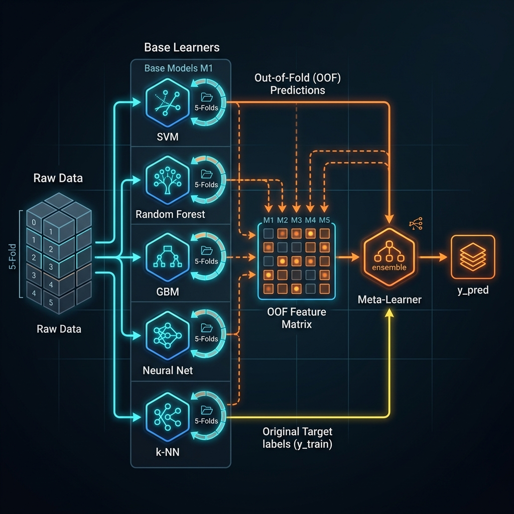

# Stacking (Stacked Generalization)

> **Combining the wisdom of diverse experts.**

**What you will learn:** In this guide, you will understand the core concepts of Stacking (Stacked Generalization), how to implement it from scratch vs. using Scikit-learn, and how to answer technical interview questions.

---

## 1. What Is Stacking (Stacked Generalization)?

Stacking is an ensemble machine learning algorithm. It involves combining the predictions from multiple diverse machine learning models on the same dataset. However, rather than voting or averaging, Stacking trains a Meta-Model to learn how to best combine the predictions of the base models.

### Real-World Analogy
*Analogy:* You are a CEO (Meta-Learner) with three advisors: a Data Analyst, a Lawyer, and an Accountant (Base Models). You don't just take a majority vote; you learn that the Accountant is always right about budget issues, and the Lawyer is right about contracts. You learn *how* to weigh their opinions.

---

## 2. Mathematical Formulation

### Base Model Out-of-Fold Predictions:

$$ Z_{i, m} = \hat{f}_{m}^{-k(i)}(x_i) $$

| Symbol | Meaning |
|---|---|
| $Z_{i, m}$ | Meta-feature for instance $i$ from base model $m$ |
| $\hat{f}_{m}^{-k(i)}$ | Model $m$ trained on all folds except fold $k$ |
| $x_i$ | Input features for instance $i$ |

### Meta-Learner:

$$ \hat{y}_i = \text{MetaModel}(Z_{i, 1}, Z_{i, 2}, \dots, Z_{i, M}) $$

| Symbol | Meaning |
|---|---|
| $\hat{y}_i$ | Final stacked prediction |
| $\text{MetaModel}$ | Often Logistic Regression or Ridge Regression |

---

## 3. How It Works — Step by Step



**Step 1:** Initialize the model.
**Step 2:** Iteratively fit to the target (residuals or gradient).
**Step 3:** Optimize the specific loss function using defined parameters.
**Step 4:** Combine outputs into final robust predictions.

---

## 4. Key Assumptions

| Assumption | Why It Matters | What Happens If Violated |
|---|---|---|
| Out-of-fold inputs | Meta-learner needs unbiased inputs | Overfitting (Meta-learner just trusts the most overfit base model) |
| Diverse base models | Need uncorrelated errors | No improvement over best base model |

---

## 5. When to Use / When Not to Use

| ✅ Use When | ❌ Avoid When |
|---|---|
| Kaggle final submissions | Need an interpretable model |
| Maximizing accuracy | Low latency required |

---

## 6. Implementation Overview

| Aspect | From Scratch (NumPy) | Library (Scikit-learn) |
|---|---|---|
| CV | Manual K-Fold array filling | `StackingClassifier` |

### Scikit-learn / Native Library Quick Start

```python
from sklearn.ensemble import StackingClassifier, RandomForestClassifier
from sklearn.linear_model import LogisticRegression
estimators = [('rf', RandomForestClassifier()), ('xgb', XGBClassifier())]
clf = StackingClassifier(estimators=estimators, final_estimator=LogisticRegression())
clf.fit(X_train, y_train)
```

---

## 7. Top 5 Interview Questions

**Q1: Why must we use Out-of-Fold (OOF) predictions?**
- If base models predict on the same data they trained on, complex models will perfectly predict the training set, causing the meta-learner to entirely over-weight them.

**Q2: What makes a good Meta-Learner?**
- A simple linear model like Logistic or Ridge Regression. Complex meta-learners can easily overfit the meta-features.

**Q3: How should base models be selected?**
- They should be diverse (e.g., a Tree, a Neural Network, and an SVM). Uncorrelated errors allow the meta-learner to pick up different signals.

**Q4: Is Stacking used in production?**
- Rarely in low-latency systems due to the cost of running multiple models. It is heavily used in Kaggle and batch-processing tasks.

**Q5: What is the difference between Blending and Stacking?**
- Stacking uses K-Fold CV to generate OOF predictions. Blending uses a single simple hold-out validation set.

---

## 8. Quick Reference Table

| Item | Detail |
|------|--------|
| **Algorithm Type** | Ensemble Learning |
| **Strengths** | Extremely high accuracy |
| **Weaknesses** | Can be complex to tune |

---

## 9. References & Further Reading

| Resource | Link |
|---|---|
| Paper | [Stacked Generalization (Wolpert, 1992)](https://www.machinelearningplus.com/machine-learning/stacking/) |

---

## 10. Environment & Setup

To run the accompanying Jupyter Notebook, ensure you have the following installed:
```bash
pip install numpy pandas scikit-learn matplotlib seaborn
```
For specific libraries, see the top cell of the Jupyter Notebook.
